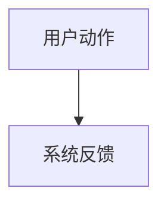

# FrameLean Feature Analysis

Analyze a FrameLean feature as a project-specific product and architecture node. Produce `docs/features/{module}/{version}/analysis.md` when the user asks for a persisted analysis; otherwise provide the same structure inline.

## Required Context

Read `AGENTS.md`, `docs/README.md`, and the current project docs relevant to the feature. For existing functionality, inspect real code and tests before writing analysis. Do not let `docs/plans/` or `docs/archive/` override current source or `docs/develop/`.

If the analysis may affect implementation, keep the `framelean-workflow` gate: do not move to design, branch setup, tests, or implementation until the user explicitly says `可以`.

## Output Shape

Use Chinese. Keep the analysis project-specific to FrameLean.

````markdown
# {功能名} — 功能分析

## 概述

## 一、交互链

### 场景 1：{场景名}

**用户故事**：作为{角色}，我想{做什么}，以便{达到什么目的}。

{用户可感知、可验证的操作路径}



## 二、逻辑树

### 事件流：{场景名}

| 时刻 | 事件 | 处理 | 产生的新事件 |
| --- | --- | --- | --- |

### 状态流转

| 实体 | 触发事件 | 前状态 | 后状态 |
| --- | --- | --- | --- |

## 三、功能编号与网络定位

### 本次新增节点

| 编号 | 功能节点 | 层级 | 简介 |
| --- | --- | --- | --- |

### 前置依赖

| 依赖节点 | 依赖方式 | 是否已有 |
| --- | --- | --- |

### 边界接口

| 接口/协议/数据结构 | 定义方 | 消费方 | 敏感度 |
| --- | --- | --- | --- |

## 四、结论

- 开发顺序建议
- 复杂度集中点
- 暂不实现内容及理由
````

## FrameLean Node Layers

- `I-*`: infrastructure, local runtime, persistence, FFmpeg / FFprobe, scripts, platform packaging, update service when present.
- `D-*`: domain entities, value objects, application use cases, repositories, services, state transitions.
- `F-*`: UI foundations under `features/workbench`, shared controls, dialog shell, notification shell, provider wiring.
- `P-*`: user-visible product workflows such as import, configure, preview, compress, pause, retry, reveal output, settings, about/update entry.

Do not assign feature-network numbers to pure visual tuning, spacing, icon swaps, typo fixes, or generated metadata unless they change a durable product capability.

## Analysis Rules

- Separate interaction chains from logic trees; they are different projections.
- Interaction chains must name what the user clicks, drags, sees, confirms, or recovers from.
- Logic trees must name the relevant FrameLean layers, use cases, providers, entities, repositories, services, scripts, or platform runtime paths.
- Mark whether dependencies already exist. Do not invent completed modules.
- For existing code, state source evidence and avoid speculation.
- For new requests, mark assumptions and unresolved boundaries.
