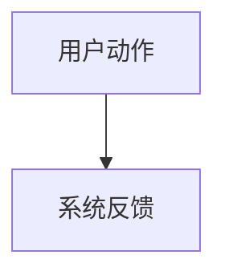

# FrameLean Feature Analysis

Analyze a FrameLean feature as a product and architecture node. Default to inline output. Persist only when the user asks or when the result becomes a confirmed backlog item, stable version fact, important decision, or reusable lesson.

## Shared Context

Read `.agents/skills/README.md` first and follow the shared pre-read protocol.

For unspecified next-work requests, read `docs/work/backlog.md` and recommend 2-3 unfinished items, prioritizing `待确认` and P1 before lower-priority candidates. Do not invent a new requirement when the backlog has relevant work.

For existing functionality, inspect related source and tests after reading the docs. Use `rg` to find relevant modules, classes, use cases, providers, tests, scripts, and config.

## Output Shape

Use Chinese. Keep the analysis specific to FrameLean.

````markdown
# 功能名 — 功能分析

## 概述

## 一、交互链

### 场景 1：场景名

**用户故事**：作为角色，我想做什么，以便达到什么目的。

用户可感知、可验证的操作路径。



## 二、逻辑树

### 事件流：场景名

| 时刻 | 事件 | 处理 | 产生的新事件 |
| --- | --- | --- | --- |

### 状态流转

| 实体 | 触发事件 | 前状态 | 后状态 |
| --- | --- | --- | --- |

## 三、功能定位

| 功能节点 | 层级 | 是否已有 | 证据 |
| --- | --- | --- | --- |

## 四、边界和依赖

| 接口、协议或数据结构 | 定义方 | 消费方 | 风险 |
| --- | --- | --- | --- |

## 五、结论

- 开发顺序建议
- 复杂度集中点
- 暂不实现内容及理由
````

## Analysis Rules

- Separate interaction chains from logic trees.
- Name user-visible operations, feedback, recovery paths, and acceptance signals.
- Name relevant FrameLean layers: `features`, `application`, `domain`, `infrastructure`, `app`.
- Mark whether dependencies already exist and cite evidence.
- If docs and code disagree, state the conflict instead of smoothing it over.
- Do not proceed to `framelean-feature-plan` or implementation until the user accepts the analysis or asks for the full workflow.
