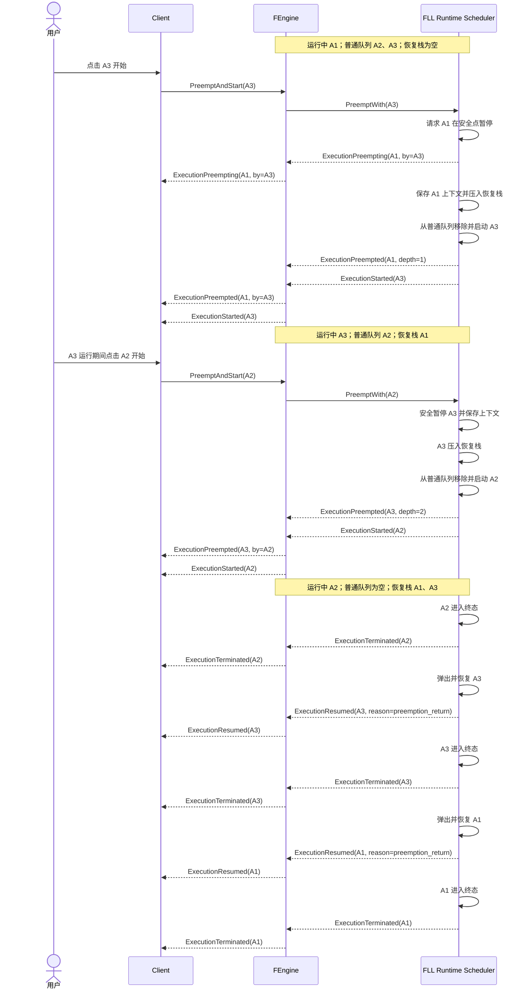

# LIFO 抢占式执行与自动恢复

> 本文保留最初的单 lane 抢占语义。多资源槽后的现行设计由 [资源池并发与按池 LIFO 恢复](260727-resource-pool-concurrency.md) 补充并取代其中的“全局唯一活动位/全局恢复栈”部分。

## 日期

2026-07-26

## 状态

已接受并实现。

本文记录已落地的执行调度语义。wire model 由 `fengine/src/protocol.rs` 拥有，FLL Task、execution state、checkpoint 和 Scheduler API 由 FLL Runtime 拥有。当前真实 Backend 覆盖可兼容媒体的 libav packet stream-copy/remux；需要转换阶段的完整转码链不在本决策的已实现范围内。

## 背景

用户将 A1、A2、A3 加入串行执行队列后，正常顺序为 A1 完成后执行 A2，再执行 A3。用户在 A1 运行期间点击 A3 的开始按钮，期望的不是把 A3 移到普通等待队列头部，而是立即抢占：

1. A1 在安全点暂停。
2. A3 立即运行。
3. A3 运行期间再次点击 A2，A3 在安全点暂停，A2 立即运行。
4. A2 终止后恢复 A3。
5. A3 终止后恢复 A1。

这是一种允许嵌套的 LIFO（后进先出）抢占与恢复语义，不能用静态队列重排表达。

## 决策

### 1. 区分拖拽排序与点击开始

- 拖拽任务或任务夹只重排普通等待队列，遵循 [任务夹摊平与跨阶段队列顺序](260726-task-folder-queue-flattening.md)。
- 点击非当前任务的开始按钮发起 `PreemptAndStart(target_task_id)` 意图，抢占当前执行任务。

Client 不能先在本地把当前任务标记为暂停；只有收到 FEngine/FLL 的安全暂停事件后才能更新权威投影。

### 2. 使用活动任务、普通队列和恢复栈

串行执行 lane 包含三个调度结构：

```text
active_execution
normal_waiting_queue
preempted_resume_stack
```

恢复栈使用 LIFO：最后被抢占的任务最先恢复。

示例状态变化：

| 时刻 | 当前运行 | 恢复栈（底 -> 顶） | 普通等待队列 |
| --- | --- | --- | --- |
| 初始 | A1 | 空 | A2、A3 |
| 点击 A3 开始 | A3 | A1 | A2 |
| A3 运行时点击 A2 | A2 | A1、A3 | 空 |
| A2 终止 | A3 | A1 | 空 |
| A3 终止 | A1 | 空 | 空 |
| A1 终止 | 空 | 空 | 空 |

### 3. 抢占必须由 Runtime 原子完成

FEngine 接收并关联抢占命令，但不能绕过 FLL Runtime 直接修改 Task 状态。FLL Runtime Scheduler 是活动 Task、暂停上下文和恢复栈的权威所有者。

`PreemptAndStart` 的原子语义为：

1. 确认目标任务可以启动或恢复，并且没有重复进入活动任务、普通队列和恢复栈。
2. 请求当前活动任务在可恢复的安全点暂停。
3. 暂停成功后保存执行上下文，并把当前活动任务压入恢复栈。
4. 从普通等待队列移除目标任务。
5. 启动或恢复目标任务。
6. 发布包含抢占关系和栈深度的状态事件。

如果当前任务处于不能安全暂停的阶段，Runtime 必须返回延迟或拒绝结果；目标任务不能先启动，当前任务也不能被假标记为已暂停。

### 4. 抢占任务任意终态都会展开恢复栈

抢占任务进入以下任意终态时，都应尝试恢复栈顶任务：

- `completed`
- `failed`
- `cancelled`

Runtime 从栈顶向下弹出，跳过已经终止或明确由用户暂停的任务，恢复第一个仍可恢复的抢占任务。恢复栈为空后，才从普通等待队列启动下一项。

用户主动暂停与抢占暂停必须分开记录：

```text
paused
  pause_reason = user

preempted
  pause_reason = preemption
  preempted_by_execution_id = <execution_id>
```

`pause_reason = user` 的任务不能因为其他任务终止而自动恢复；`pause_reason = preemption` 的任务属于自动恢复链。

### 5. Client 只投影抢占关系

Client 负责：

- 把用户点击开始转换为抢占意图。
- 在抢占过渡期间禁止重复提交相同操作。
- 展示“正在为某任务暂停”“被某任务临时抢占”和恢复顺序。
- 保存 FEngine 返回的执行状态、抢占来源、恢复深度和事件 sequence。
- Client 重启后向 FEngine 查询当前活动任务、普通队列和恢复链，并重建界面投影。

Client 不维护权威恢复栈，不直接控制媒体进程，也不根据本地任务列表自行恢复任务。

### 6. FEngine 负责进程级协议和投影

FEngine 负责：

- 接收 `PreemptAndStart` 并关联 request、Client task 和 execution identity。
- 调用 FLL Runtime 的原子抢占 API。
- 把 Runtime 状态转换为可关联、单调有序的协议事件。
- 对 Client 暴露活动任务、普通等待队列和恢复链的进程级 Snapshot。
- 保证相同 request ID 的幂等重放不会重复压栈或重复启动目标任务。

FEngine 可以保存进程级投影，但不能成为 FLL Task 状态和暂停上下文的第二权威源。

## 抢占与嵌套恢复时序



## 状态与事件要求

目标执行状态至少需要表达：

```text
queued
running
preempting
preempted
resuming
paused
completed
failed
cancelled
```

目标事件至少需要携带：

```text
execution_id
client_task_id
state
pause_reason
preempted_by_execution_id
resume_depth
sequence
```

具体字段、兼容性和错误类型必须在实现阶段进入 protocol v1 与 FLL Runtime Schema 的各自权威位置，不能由本文替代代码定义。

## 多执行位边界

本决策完整定义单个串行执行 lane 内的 LIFO 抢占语义。

- 存在空闲执行位时，用户点击开始应直接使用空闲位，不需要抢占。
- 所有执行位都忙时，选择哪个活动任务作为抢占对象属于独立的资源与受害者选择策略，需要后续确认。
- 一旦选定执行 lane，该 lane 内仍按本文的 LIFO 恢复规则运行。

在受害者选择策略确认前，不得用隐式随机选择或容器遍历顺序决定暂停哪个活动任务。

## 故障与恢复

- 抢占命令在安全暂停完成前失败时，原活动任务继续运行，目标任务保持原位置。
- 目标任务启动失败时，Runtime 必须尝试恢复刚刚被压栈的任务。
- 抢占任务失败或被取消时，仍按 LIFO 恢复前一个任务。
- Client 连接中断不改变 Runtime 的恢复栈；本机 FEngine 守护连接继续维持 Worker 和心跳，重连后通过同一 session 的 FEngine Snapshot 对账。
- FEngine 进程崩溃后的跨进程媒体断点恢复不由本文保证。没有持久化执行上下文和经过验证的恢复实现时，不能宣称崩溃后可继续媒体处理。

## 不变量

- 同一 execution ID 不能同时存在于活动任务、普通等待队列和恢复栈的多个位置。
- 抢占必须先完成安全暂停，再启动目标任务。
- 恢复顺序必须严格后进先出。
- 拖拽排序不能修改恢复栈。
- Client 不能自行弹栈、恢复任务或伪造暂停完成。
- FEngine 不能绕过 FLL Runtime 修改 Task 状态。
- 用户主动暂停的任务不能被抢占链自动恢复。

## 非目标

- 本决策不定义分析任务的抢占；分析队列只使用普通等待顺序和优先级。
- 本决策不定义多执行位全部繁忙时的受害者选择策略。
- 本决策不保证 FEngine 进程崩溃后的媒体断点续作。
- 本决策不保证需要 Decoder、Encoder 或 Processor 的完整转码链。
