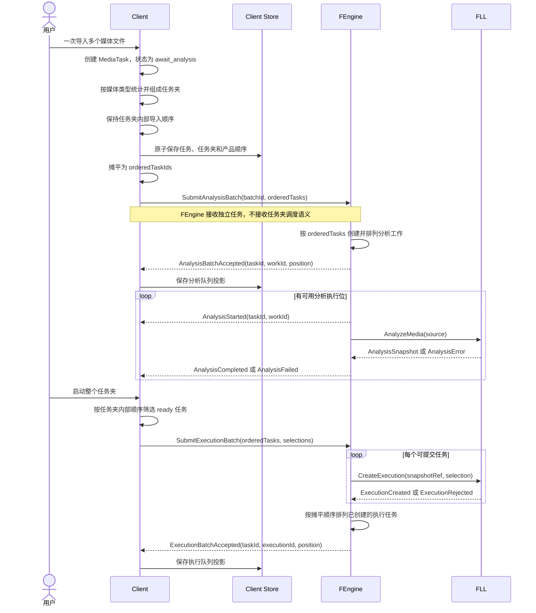
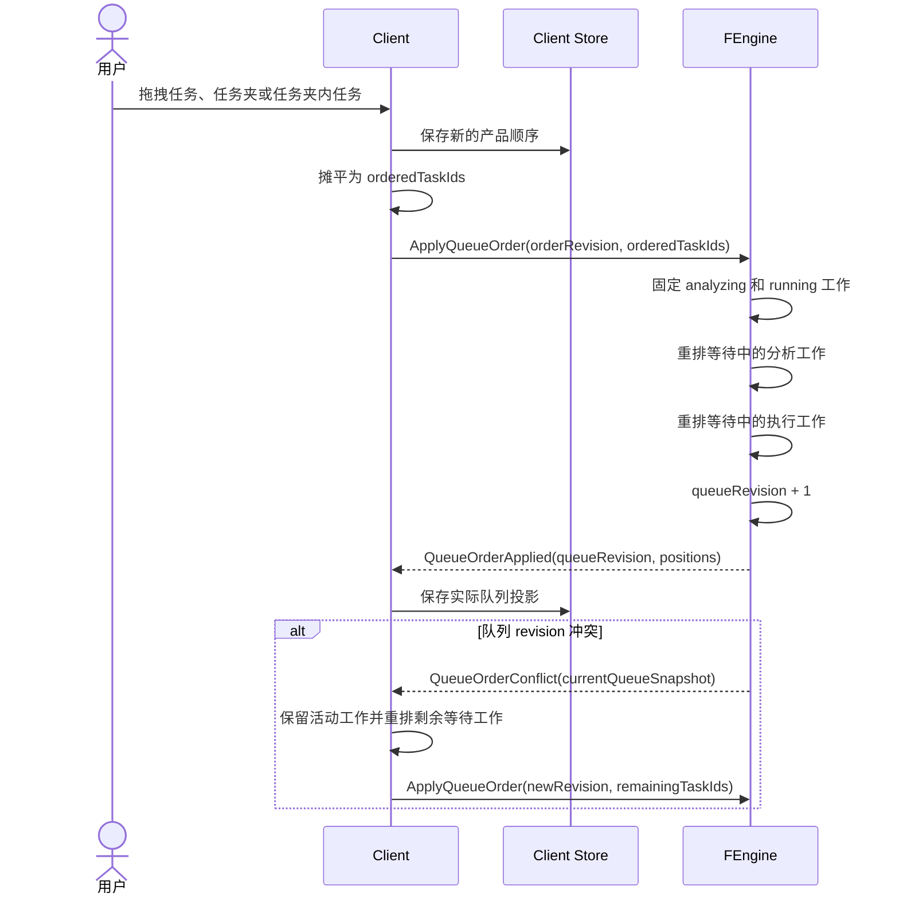

# 任务夹摊平与跨阶段队列顺序

## 日期

2026-07-26

## 状态

已接受并实现。

本文记录已落地的任务夹、批次和队列语义。wire model 以 `fengine/src/protocol.rs` 为代码事实，Client 原子导入与摊平以 Drift repository/use case 及测试为事实，FLL Runtime 不包含任务夹模型。

## 背景

Desktop Client 支持一次导入多个媒体任务，并在同一导入批次内将相同媒体类型且数量达到 2 个及以上的任务组成任务夹。任务夹需要同时满足两种需求：

- 在 Client 中作为用户可见的连续分组，支持整体移动、批量配置和批量启动。
- 在 FEngine 中仍以独立媒体任务参与分析和执行，不把任务夹变成媒体处理或调度实体。

分析队列和执行队列属于不同处理阶段。两者需要遵循同一份用户顺序，但不能合并为一条物理队列，也不能让 FLL 了解 Client 的任务夹模型。

## 决策

### 1. 任务夹只属于 Client 产品模型

任务夹负责分组、展示、排序和批量操作。FEngine 和 FLL 不保存任务夹实体，也不根据 `folder_id` 决定媒体分析、执行顺序或资源调度。

Client 向 FEngine 提交的是摊平后的独立任务。批次 ID 可以用于关联一次批量请求，但不赋予 FEngine 任务夹语义。

### 2. 导入批次先完整组织，再提交分析

Client 不在每创建一个 `MediaTask` 后立即提交分析，而是按以下顺序处理一次导入批次：

1. 为所有可接受文件创建 `MediaTask`，初始状态为 `await_analysis`。
2. 按媒体类型统计本批次任务数量。
3. 同一类型数量达到 2 个及以上时创建任务夹；数量为 1 时保留独立任务。
4. 任务夹内保持原始导入顺序。
5. 任务夹在顶层占据其第一个成员原本所在的位置；其他独立任务保持相对顺序。
6. 在一个 Client 持久化事务中保存任务、任务夹和排序。
7. 摊平最终产品顺序，再按该顺序向 FEngine 提交分析任务。

这样可以避免任务已经进入分析队列后，Client 才决定把它们重新组织成任务夹所产生的顺序抖动。

### 3. Client 产品顺序是两个阶段队列的共同输入

Client 保存两层顺序：

```text
top_level_order
folder_child_order
```

摊平算法按顶层顺序遍历：

```text
独立任务 -> 追加该 task_id
任务夹   -> 按 folder_child_order 追加所有子 task_id
```

例如：

```text
视频任务夹
  V1
  V2
  V3
独立音频任务 A1
图片任务夹
  I1
  I2
```

摊平结果为：

```text
V1 -> V2 -> V3 -> A1 -> I1 -> I2
```

同一份摊平顺序分别投影到两条逻辑队列：

- 分析队列只选择已经提交分析且尚未开始的任务。
- 执行队列只选择用户已经提交执行且尚未开始的任务。

`ready` 任务在用户点击开始前不属于执行队列。单个任务在同一时刻只参与符合其当前阶段的队列。

### 4. FEngine 拥有实际队列位置

Client 拥有用户期望的产品顺序；FEngine 拥有分析和执行的实际等待队列、队列 revision 以及每个工作的真实位置。

Client 必须保存 FEngine 返回的队列投影，而不能仅根据本地列表下标宣称实际队列已经改变。推荐的目标模型为：

```text
ClientProductOrder
  order_revision
  ordered_task_ids

AnalysisQueueProjection
  task_id
  analysis_work_id
  queue_position
  queue_revision

ExecutionQueueProjection
  task_id
  execution_id
  queue_position
  queue_revision
```

### 5. 拖拽排序同步修改两条等待队列

用户拖拽独立任务、任务夹或任务夹内任务时，Client 先保存新的产品顺序，再重新摊平所有任务，并向 FEngine 提交一次原子顺序更新：

```text
ApplyQueueOrder(
  client_order_revision,
  ordered_task_ids
)
```

FEngine 使用 `task_id` 与分析工作、执行任务的映射，同时重排两条逻辑队列：

- 已经处于 `analyzing` 或 `running` 的工作固定，不被拖拽排序抢占。
- 只有仍在等待的分析工作和执行工作参与重排。
- 已完成、失败、取消或尚未提交到对应队列的任务只改变 Client 产品顺序。
- 移动整个任务夹时，仍在等待的子任务按任务夹内部顺序作为连续区块移动。
- 任务夹部分成员已经开始时，只移动剩余等待成员，不改变活动成员。

FEngine 成功应用后递增 queue revision，并返回两条队列的新位置。若重排期间有任务开始导致 revision 冲突，FEngine 返回当前队列 Snapshot；Client 保留活动工作，对剩余等待工作重新摊平后重试。

拖拽排序只改变普通等待顺序。用户点击某个任务的开始按钮所触发的抢占式插队不属于本决策，见 [LIFO 抢占式执行与自动恢复](260726-lifo-preemptive-execution.md)。

## 批量导入与摊平时序



## 拖拽重排时序



## 组件职责

| 组件 | 职责 |
| --- | --- |
| Desktop Client | 创建任务夹、保存产品顺序、摊平任务、提交批次、发起重排并展示实际队列投影 |
| FEngine | 保存 task ID 与工作 ID 映射，维护分析和执行的外部等待队列、revision、实际位置和重排冲突 |
| FLL Runtime | 分析媒体、创建和运行进程内 Task；不了解 Client 任务夹或工作台顺序 |

## 不变量

- 任务夹不能成为 FLL Task 或 FEngine 调度实体。
- 任意一次摊平必须产生稳定、无重复的 `task_id` 顺序。
- 分析队列和执行队列保持独立，但都从同一 Client 产品顺序派生。
- 活动工作不能通过拖拽重排被暂停、重启或改变身份。
- FEngine 返回的位置才是实际队列位置，Client 本地下标只是用户意图。
- 队列重排不能通过取消并重新提交任务实现。

## 非目标

- 本决策不定义用户点击开始按钮后的抢占式执行。
- 本决策不定义多执行位之间的资源分配或抢占受害者选择。
- 本决策不定义跨进程媒体断点续作。
