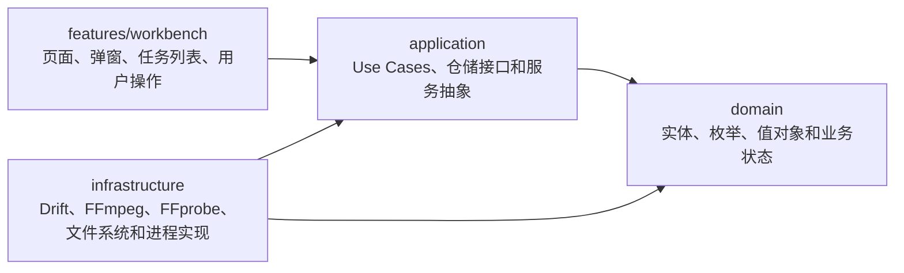

# FrameLean 架构说明

## 文档目的

这个文件记录 FrameLean 当前项目架构、核心模块解析，以及为什么采用这种架构。

这里描述的是当前代码事实，不记录产品规划或历史开发日志。测试和构建说明看 `docs/develop/test-plan.md`，文档总入口看 `docs/README.md`，项目上下文看根目录 `CONTEXT.md`。

## 架构总览

FrameLean 是一个本地媒体处理桌面应用。当前主路径是：用户导入视频、图片或音频，应用使用 FFprobe 分析媒体信息，按任务配置构造 FFmpeg 命令，执行压缩或格式转换，并把任务状态持久化到 SQLite。视频仍保留最完整的配置、预览和缩略图能力；图片和音频当前支持默认配置下的导入、分析和基础处理。

项目采用接近 Clean Architecture 的分层方式：

```text
features -> application -> domain
                  |
                  v
            infrastructure
```



依赖方向约束：

- `domain` 不依赖 Flutter、Drift、FFmpeg 或文件系统。
- `application` 定义 Use Cases、服务抽象、仓储接口和核心流程，可以依赖 `domain`。
- `infrastructure` 实现数据库、文件系统、FFmpeg / FFprobe 和平台差异，可以依赖 `application` 抽象和 `domain`。
- `features` 是 UI 和页面状态协调层，通过 Riverpod notifier 调用 application 用例，不直接拼装数据库或 FFmpeg 实现。
- `app` 只负责应用入口、主题和路由，不承载业务规则。

## 为什么使用这个架构

- UI 和业务规则分离：工作台页面可以改版，而任务状态、命令构造和队列执行不需要跟着重写。
- 便于测试：FFmpeg 命令构造、压缩估算、队列执行和媒体分析可以脱离 Flutter 页面单独测试。
- 便于跨平台：macOS 和 Windows 的 FFmpeg 路径、文件管理器打开方式和编码器能力差异集中在 infrastructure。
- 便于恢复和校正任务状态：任务实体和数据库模型清晰分离，应用重启后可以从本地 SQLite 重新读取任务并检查源文件。
- 便于替换实现：未来如果调整 FFmpeg 运行时、日志系统或数据库策略，可以优先替换 infrastructure 层。

## 源码目录

```text
lib/
  main.dart
  app/
    app.dart
    app_router.dart
  domain/
    entities/
    enums/
    value_objects/
  application/
    repositories/
    services/
      app_notifications/
      input_runtime/
      ffmpeg_planning/
      execution/
    use_cases/
      app_settings/
      media_tasks/
  infrastructure/
    database/
    providers/
    repositories/
    services/
      app_notifications/
      input_runtime/
      ffmpeg_planning/
      execution/
  features/
    notifications/
      providers/
      services/
      widgets/
    workbench/
      pages/
        workbench_page/
      providers/
      widgets/
        form_controls/
        media_task_list/
```

平台与工程目录：

```text
macos/
windows/
linux/
web/
test/
scripts/
tool/
third_party/
legal/
docs/
.workspace/  本地 ignored 工作区，不进入版本库
```

当前验证和发布重点是 macOS Universal 2（Intel x86_64 + Apple Silicon arm64）与 Windows x64。Linux 和 Web 目录来自 Flutter 工程模板，不代表已经完成产品级支持。

## 核心模块解析

### app

`app` 保存应用外壳：

- `FrameLeanApp`：创建 `MaterialApp.router`，配置主题、字体、按钮圆角和图标尺寸。
- `appRouter`：使用 GoRouter。当前 `/` 指向 `WorkbenchPage`，`/settings` 指向全屏应用设置页。
- `AppNotificationHost`：位于应用根节点，订阅应用通知展示事件并显示全局浮层提示；任务成功通知到达时按当前设置触发完成提示音。
- `AppNotificationHost` 对临时通知做单槽展示：新通知到达时当前通知先退出，再展示最新通知；通知中心打开时临时通知隐藏，但通知仍会先持久化。
- `main.dart`：初始化 Flutter binding，创建 Riverpod `ProviderScope`。

### domain

`domain` 保存不依赖 Flutter UI 的业务模型：

- `MediaTask`：媒体任务主实体。
- `AppSettings`：应用级设置实体。
- `MediaTaskConfig`：单个媒体任务的通用配置入口，按 `mediaKind` 持有 `video`、`image` 或 `audio` 分类型配置。
- `VideoProcessingConfig`、`ImageProcessingConfig`、`AudioProcessingConfig`：视频、图片、音频的分类型处理配置。
- `VideoTaskConfig`：旧视频配置兼容对象，可映射为 `MediaTaskConfig.video`。
- `MediaAnalysisResult`：FFprobe 分析结果。
- `SourceFileFingerprint`：源文件快速指纹，用于检测源文件是否被替换或移动。
- 枚举：任务状态、通用输出格式、视频编码、编码器后端、分辨率预设、压缩模式、推荐方案预设、媒体类型、任务用途等。

`MediaTask` 是任务状态流转的核心。它提供 `markRunning`、`markPaused`、`markCompleted`、`markFailed`、`markCancelled`、`markMissingSource`、`replaceInputFile`、`withAnalysisResult` 等方法，避免 UI 或仓储直接拼装状态。

### application

`application` 保存仓储接口、服务抽象和用例。它描述“这个应用能做什么”和“什么时候调用哪些能力”，但不直接依赖 Drift、文件系统或 Flutter Widget。

仓储抽象：

- `MediaTaskRepository`：任务列表、任务状态、排序、保存、删除和清空的持久化接口。
- `AppSettingsRepository`：应用设置读取和保存接口。
- `AppNotificationRepository`：应用通知历史读取、保存、已读和关闭状态持久化接口。

Use Cases：

- `LoadAppSettingsUseCase`、`SaveAppSettingsUseCase`：读取、校验并保存应用设置。
- `AppSettingsSaveCoordinator`：协调设置保存后的主题缓存、运行时刷新、输出配置回填和通知记录；调用方必须传入设置保存目标，避免保存链路丢失“哪个分区触发”的业务语义。
- `AppSettingsSaveTarget`：设置保存的结构化事件类型。应用设置、视频 / 图片 / 音频默认任务配置、输出配置和编码器配置拥有各自通知标题；只有输出配置保存会刷新非运行状态任务，任务默认配置只影响后续导入。
- `AppNotificationManager`：统一记录应用通知，先写入持久化仓储，再向根级通知 Host 发出展示事件；设置保存等跨页面异步操作通过它记录成功或失败结果。通知标题应由事件发起方提供真实业务语义，而不是由 Toast 根据泛化文案推断。
- `AppNotificationManager` 还提供类型化任务完成 / 失败通知，并通过持久化 `payload_json` 保存成果物路径等动作数据；任务通知标题直接表达任务成功或失败，文件名、输出路径和失败原因保留在通知正文。
- `TaskCompletionSoundPlayer`：定义任务完成提示音播放抽象；本地实现位于 infrastructure，按平台调用系统播放器。
- `ImportMediaTaskUseCase`：从本地路径创建分析中的任务，并套用应用默认设置。
- `AnalyzeMediaTaskUseCase`：调用 FFprobe 分析任务，写回分析结果或失败状态。
- `ReconcileMediaTasksUseCase`：应用启动或刷新时检查源文件、指纹和缺失分析结果。
- `ReplaceMissingSourceUseCase`：为丢失源文件任务重新指定本地文件。
- `RetryMediaTaskUseCase`：失败任务重试前检查源文件，并决定是否重新分析。
- `ReorderMediaTasksUseCase`：保存任务列表排序。
- `StartExecutionQueueUseCase`、`StartOrResumeMediaTaskUseCase`、`PauseMediaTaskExecutionUseCase`、`PauseAllMediaTaskExecutionsUseCase`：进入队列执行、单任务开始 / 继续 / 暂停和底部暂停全部。
- `ClearMediaTasksUseCase`、`DeleteMediaTaskUseCase`：删除任务前先处理正在执行的 FFmpeg 进程。
- `GeneratePreviewFramesUseCase`：为工作台预览调用运行时解析和预览帧生成服务。

服务抽象按阶段分组：

- `services/input_runtime/`：`MediaAnalyzer`、`SourceFileChecker`、`MediaKindResolver`、`SourceFileFingerprintReader`、`FfmpegLocator`、`FfmpegRuntime`、`FfmpegEncoderCapabilities`。
- `services/ffmpeg_planning/`：`CompressionAdvisor`、`CompressionEstimator`、`FfmpegCommandBuilder` 和默认压缩建议实现。
- `services/execution/`：`FfmpegTaskQueueRunner`、`FfmpegProcessStarter`、`FfmpegProcessController`、`FfmpegProcessObserver`、`PreviewFrameGenerator`、`VideoThumbnailGenerator`。

### infrastructure

`infrastructure` 保存 application 抽象的本地实现：

- `database/`：Drift + SQLite 表、迁移、数据库连接和持久化兼容常量。
- `providers/`：Riverpod 依赖装配入口，按数据库、仓储、输入运行时、FFmpeg 规划和执行拆分。
- `repositories/`：Drift 仓储实现，以及持久化字符串到领域枚举的 mapper。
- `services/input_runtime/`：本地文件检查、扩展名媒体类型识别、源文件指纹读取、FFmpeg / FFprobe 定位、FFprobe JSON 分析。
- `services/ffmpeg_planning/`：默认 FFmpeg 命令构造器，以及输出路径、编码器解析、视频参数、步骤和日志提示构造 helper。
- `services/execution/`：本地 FFmpeg 进程启动、跨平台进程控制、进度观测、预览帧生成和视频缩略图生成。
- `services/app_notifications/`：本地任务完成提示音播放实现，读取内置 Flutter asset，缓存到临时目录后交给系统播放器。

持久化兼容层集中在：

- `PersistenceCompatibility`：保存当前持久化值和历史兼容值。
- `CompressionModeMapper`：把旧数据库中的 `smart`、`quality` 映射为当前领域中的 `CompressionMode.preset`，避免旧值泄漏到业务层。

### features/workbench

`features/workbench` 是当前主要 UI 功能区：

- `pages/workbench_page.dart`：工作台入口页面，负责组装页面状态、任务操作和工作台弹窗流程。
- `pages/workbench_page/layout/`：顶部栏、底部栏、任务列表容器和工作台外壳。
- `pages/workbench_page/dialogs/`：任务配置、完成、失败、清空、重命名、压缩确认等工作台弹窗。
- `pages/workbench_page/overlays/`：拖拽覆盖层和右上角通知浮层。
- `pages/workbench_page/configuration/`：工作台常量、格式化、轻量模型和 UI 判断策略。
- `widgets/form_controls/`：可复用表单控件，例如路径输入和配置下拉。
- `widgets/media_task_list/`：任务列表项、状态徽标、操作按钮和缩略图组件。
- `MediaTaskListNotifier`：任务管理和任务状态管理入口，通过 media task use cases 进入 application。
- `WorkbenchPreviewNotifier`：预览状态入口，通过 `GeneratePreviewFramesUseCase` 进入 application。

### features/settings

`features/settings` 是全屏应用设置功能区：

- `pages/app_settings_page.dart`：`/settings` 页面入口，负责加载和保存 `AppSettings`、接入缓存清理和 Windows 清理卸载入口。
- `sections/`：设置分区渲染和分区级保存 / 回滚逻辑，当前包含应用、关于、视频、图片、音频、输出和编码器配置。
- `widgets/`：设置页通用 UI 组件，例如侧边栏、表单容器、分区保存按钮、输入控件和关于页维护组件。
- 设置页复用 `features/workbench/widgets/form_controls/` 的路径输入和下拉控件，保持与工作台配置控件一致。
- 应用设置中的“关闭通知角标”写入 `AppSettings.hideNotificationBadge`；工作台通过共享 `appSettingsProvider` 读取并仅控制角标可见性。
- 应用设置中的“完成音频设置”写入 `AppSettings.taskCompletionSound`；根级通知 Host 在任务成功通知到达时读取该设置并播放对应内置提示音。

工作台当前支持：

- 文件选择和拖拽导入。
- 任务列表、排序、右键菜单、重命名、删除和清空。
- 源文件丢失后的重新指定。
- 任务配置保存。
- 单任务开始 / 暂停 / 继续 / 重试。
- 队列启动、底部暂停全部、按实时列表顺序连续执行和任务行插队。
- 完成、失败和分析错误提示。
- 缩略图和压缩前后预览帧。

### features/notifications

`features/notifications` 保存通知中心的 UI 状态、动作解析和右侧浮层：

- `providers/notification_center_provider.dart`：保存通知中心开关状态，供工作台和根级临时通知 Host 共享。
- `services/notification_center_action_resolver.dart`：按通知类型和持久化载荷解析可执行动作；当前任务成功通知解析为“打开成果物所在位置”。
- `widgets/notification_center_panel.dart`：自制右侧浮层，使用 `AnimationController` 和 `SlideTransition` 从右向左进入，不使用 Flutter `Drawer`，支持遮罩 / `Esc` 关闭、批量已读和清扫。
- 工作台顶栏未读角标直接订阅持久化通知流；打开通知中心后，当前和浮层打开期间新产生的通知会被标记为已读。
- 通知项按标题、创建时间和正文分层展示；任务失败原因和输出路径保留在正文中，避免和时间揉成单行摘要。
- 右上角临时通知只承载即时反馈，通知中心承载完整历史。临时通知为中等密度卡片，关闭按钮固定在尾部，详情最多两行；成功 / 信息、警告、失败使用不同停留时长。
- 任务成功临时通知展示前会读取应用设置并触发完成提示音；通知中心打开时临时通知会隐藏，但完成提示音仍会触发。

## Riverpod 组装方式

FrameLean 使用 Riverpod 作为依赖注入和状态管理工具。

核心 provider：

| Provider | 类型 | 职责 |
| --- | --- | --- |
| `appDatabaseProvider` | `Provider<AppDatabase>` | 提供全局唯一数据库实例，容器释放时关闭 |
| `mediaTaskRepositoryProvider` | `Provider<MediaTaskRepository>` | 提供 Drift 任务仓储 |
| `appSettingsRepositoryProvider` | `Provider<AppSettingsRepository>` | 提供 Drift 设置仓储 |
| `appSettingsProvider` | `FutureProvider<AppSettings>` | 提供当前持久化应用设置，供工作台读取通知角标偏好 |
| `mediaKindResolverProvider` | `Provider<MediaKindResolver>` | 提供扩展名媒体类型识别实现 |
| `sourceFileCheckerProvider` | `Provider<SourceFileChecker>` | 提供本地源文件存在检查 |
| `sourceFileFingerprintReaderProvider` | `Provider<SourceFileFingerprintReader>` | 提供本地源文件指纹读取 |
| `ffmpegLocatorProvider` | `Provider<FfmpegLocator>` | 提供 FFmpeg / FFprobe 路径解析和自定义路径校验 |
| `mediaAnalyzerProvider` | `Provider<MediaAnalyzer>` | 提供 FFprobe 媒体分析实现 |
| `ffmpegRuntimeProvider` | `AsyncNotifierProvider` | 解析并缓存 FFmpeg / FFprobe 运行时和编码器能力 |
| `compressionAdvisorProvider` | `Provider<CompressionAdvisor>` | 提供压缩策略建议 |
| `ffmpegCommandBuilderProvider` | `Provider<FfmpegCommandBuilder>` | 提供 FFmpeg 命令规划服务 |
| `previewFrameGeneratorProvider` | `Provider<PreviewFrameGenerator>` | 提供压缩前后预览帧生成服务 |
| `videoThumbnailGeneratorProvider` | `Provider<VideoThumbnailGenerator>` | 提供视频缩略图生成服务 |
| `ffmpegProcessStarterProvider` | `Provider<FfmpegProcessStarter>` | 提供 FFmpeg 进程启动实现 |
| `ffmpegProcessObserverProvider` | `Provider<FfmpegProcessObserver>` | 提供 FFmpeg 进度和退出结果观测实现 |
| `ffmpegTaskQueueRunnerProvider` | `Provider<FfmpegTaskQueueRunner>` | 维持同一个队列执行器实例 |
| `mediaTaskListProvider` | `AsyncNotifierProvider` | 工作台任务列表、导入、分析、刷新和任务操作入口 |
| `workbenchPreviewProvider` | `NotifierProvider` | 工作台预览帧生成、对比比例和选中帧状态入口 |

服务实现通过 provider 暴露 application 抽象接口，UI 只调用 notifier 或用例，不直接创建 Drift、FFmpeg 进程或文件系统实现。

## 主要流程

### 应用启动

```text
main()
  -> ProviderScope
  -> FrameLeanApp
  -> GoRouter("/")
  -> WorkbenchPage
  -> mediaTaskListProvider.build()
  -> ReconcileMediaTasksUseCase
  -> 检查源文件、指纹和缺失分析结果
  -> 必要时调用 AnalyzeMediaTaskUseCase 后台分析
  -> 刷新 FFmpeg 队列状态
```

启动时只恢复数据库里的任务状态，不恢复旧 FFmpeg 进程句柄。任务会根据源文件现状做一次校正：源文件丢失会进入 `missingSource`，缺少分析结果会进入后台分析，已有 `pending` 或 `paused` 任务会让队列进入 ready；如果数据库中残留 `running` 状态，当前队列状态会按 running 处理，后续中断恢复逻辑需要特别注意这一点。

### 导入文件和后台分析

```text
文件选择 / 拖拽
  -> ImportMediaTaskUseCase
  -> MediaKindResolver 按扩展名识别类型
  -> 允许 video / image / audio
  -> SourceFileFingerprintReader 读取文件大小和修改时间
  -> AppSettingsRepository 读取新任务默认配置
  -> MediaTask.draft()
  -> 保存 analyzing 任务
  -> AnalyzeMediaTaskUseCase
  -> FfprobeMediaAnalyzer.analyze()
  -> 写入 MediaAnalysisResult
  -> 状态回到 pending
```

如果 FFprobe 不可用或分析失败，任务会保存 `analysis_error_message` 并标记为 `failed`。如果源文件在分析前丢失，任务会标记为 `missingSource`。

### 预览和缩略图

缩略图由工作台缩略图缓存协调：视频继续通过 `LocalVideoThumbnailGenerator` 抽帧，图片任务直接使用源图片作为缩略图，音频任务当前使用稳定占位表现。工作台用任务和文件状态组成 key，避免重复生成失败缩略图。

压缩预览由 `LocalPreviewFrameGenerator` 生成：

1. 根据任务、配置、分析结果、压缩建议和编码器能力生成 `PreviewFrameFingerprint`。
2. 默认在视频 5%、27.5%、50%、72.5%、95% 位置取样。
3. 每个点先抽原始帧，再生成 1 秒压缩片段，然后从压缩片段抽对比帧。
4. 预览目录位于系统临时目录 `framelean/previews/<taskId>`。

### FFmpeg 命令构造

`DefaultFfmpegCommandBuilder` 只负责构造计划，不启动进程。较细的命令规划逻辑拆在同目录 helper 中：

- `ffmpeg_output_path_builder.dart`：解析输出目录、输出文件名和路径冲突。
- `ffmpeg_encoder_resolver.dart`：根据平台能力和用户配置解析最终编码器。
- `ffmpeg_video_argument_builder.dart`：生成视频编码、码率、分辨率和质量参数。
- `ffmpeg_command_step_builder.dart`：生成单步、两遍压缩和预览片段步骤。
- `ffmpeg_command_log_hint_builder.dart`：生成策略摘要。
- `ffmpeg_command_formatters.dart`：集中格式化命令日志和参数片段。

命令计划包含：

- `args`：最后一步或单步 FFmpeg 参数。
- `steps`：一个或多个 `FfmpegCommandStep`。
- `outputPath`：输出文件路径。
- `cleanupPathPrefixes`：需要清理的临时文件前缀。
- `logHint`：供日志或 UI 展示的策略摘要。

主要规则：

- `MediaKind.video` 继续走完整视频规划链路，保留现有压缩、转封装、硬件编码、目标体积和预览片段行为。
- `MediaKind.image` 当前在默认配置下生成单步图片输出计划，使用 `ProgressMode.step`，不依赖媒体时长。
- `MediaKind.audio` 当前生成音频输出计划，使用 `-vn` 禁用视频流，并按音频格式推导编码参数，按配置写入码率、采样率和声道参数。
- `VideoCodec.source` 必须先依赖分析结果解析为 `h264` 或 `hevc`。
- `EncoderBackend.auto` 会根据 FFmpeg 实际支持和平台优先级选择硬件编码或软件编码。
- 输出目录为空时使用源文件目录。
- 自定义输出文件名会取 basename 并替换扩展名。
- 如果输出路径和源文件相同，或目标文件已存在，会自动追加 `-1`、`-2` 等后缀。
- `targetSize` 模式在软件编码下使用两遍压缩，在硬件编码下使用目标码率单遍策略。

### 队列执行

`DefaultFfmpegTaskQueueRunner` 是 FFmpeg 执行的核心协调器。UI 不直接调用它的细节方法，而是通过 `StartExecutionQueueUseCase`、`StartOrResumeMediaTaskUseCase`、`PauseMediaTaskExecutionUseCase`、`DeleteMediaTaskUseCase` 和 `ClearMediaTasksUseCase` 进入执行流程。队列执行器保存内存中的 `_executions` 和 `_foregroundTaskId`，同时把任务状态写回仓储。

状态模型：

| 队列状态 | 含义 |
| --- | --- |
| `idle` | 没有可执行或正在执行的任务 |
| `ready` | 存在 `pending` 任务或暂停中的进程 |
| `running` | 存在前台执行任务或数据库中有 `running` 任务 |

执行流程：

```text
start / startOrResumeTask
  -> 检查队列和任务状态
  -> 检查源文件
  -> 解析 FFmpeg 运行时
  -> 构造命令计划
  -> 创建执行日志文件
  -> markRunning()
  -> LocalFfmpegProcessStarter.start()
  -> FfmpegProcessController 负责暂停、继续和终止
  -> LocalFfmpegProcessObserver.observe()
  -> 根据退出结果 markCompleted() 或 markFailed()
  -> AppNotificationManager 持久化任务完成 / 失败通知
  -> 清理两遍压缩临时文件
  -> continueAfterTask()
```

暂停和恢复：

- 暂停当前前台任务时，队列执行器通过 `FfmpegProcessController.pause()` 控制底层进程，并把任务标记为 `paused`。
- 恢复暂停任务时调用 `FfmpegProcessController.resume()`，并标记为 `running`。
- macOS / Linux 当前使用 `ProcessSignal.sigstop` 和 `ProcessSignal.sigcont` 实现。
- Windows 通过 runner method channel 调用原生线程挂起 / 恢复能力，避免把 Unix signal 语义套到 Windows 进程上。
- 切换到另一个任务前，会先挂起当前前台任务。
- 如果后台观测在任务处于 `paused` 状态时收到进程终态，队列仍会完成收尾，避免任务卡在暂停状态。

取消：

- 取消单任务会通过 `FfmpegProcessController.terminate()` 终止对应进程，移除内存执行记录，清理计划临时文件，并标记为 `cancelled`。
- 清空任务会调用 `cancelAllExecutions()`，再用仓储清空 `tasks`。

连续执行：

- 当前 `continuousExecutionEnabled` 默认开启。
- 一个任务完成或失败后，队列会按 `sort_order` 和 `created_at` 找下一个 `pending` 任务继续执行。

### 进度和日志

`DefaultFfmpegCommandBuilder` 给执行命令加入：

```text
-progress pipe:1
```

`LocalFfmpegProcessObserver` 读取 stdout 中的 `out_time_ms`，结合 `analysis_duration_ms` 计算进度。stderr 被写入本次执行日志文件。

日志路径由 provider 中的 `createFfmpegExecutionLogFilePath()` 生成：

```text
<system temp>/framelean/ffmpeg-logs/<timestamp>_<taskId>_<safeFileName>.log
```

## FFmpeg 运行时边界

`LocalFfmpegLocator` 负责解析运行时，顺序是：

1. 用户设置的自定义路径。
2. 应用包或可执行文件旁边的 bundled 路径。
3. macOS / Linux 常见系统路径。
4. `which` 或 Windows `where` 找到的 PATH 工具。

解析到 FFmpeg 后会读取 `-encoders` 输出，生成 `FfmpegEncoderCapabilities`。如果读取失败，会使用 bundled fallback 能力，至少假设 `libx264` 可用。

## 数据持久化边界

Drift 数据库只保存可恢复的业务状态：

- 任务身份、源文件路径、文件名、排序。
- 任务状态、进度、输出路径和错误信息。
- 输出格式、编码、后端、分辨率、压缩模式、目标体积、自定义文件名。
- 源文件指纹。
- FFprobe 分析结果。
- 应用设置和自定义 FFmpeg / FFprobe 路径。

不入库的数据：

- FFmpeg 原始执行日志。
- 预览帧和缩略图文件。
- 两遍压缩 pass log。
- 完整 FFprobe JSON。
- 内存中的暂停进程句柄。

详细字段见 `docs/develop/data-model.md`。

## 平台边界

当前平台事实：

| 平台 | 当前状态 | 说明 |
| --- | --- | --- |
| macOS Universal 2 | 主要验证平台 | app、FFmpeg、FFprobe 和可选 QMC 适配器同时包含 x86_64 / arm64；支持 VideoToolbox 自动优先级，不可用时回退软件编码 |
| Windows x64 | 主要验证平台 | Release 构建要求内置 `ffmpeg.exe` / `ffprobe.exe`，支持 NVENC / QSV / AMF 自动优先级 |
| Linux | 工程目录存在 | 本地工具路径解析有 Linux 分支，但不是当前发布目标 |
| Web | 工程目录存在 | FFmpeg 本地进程路线不适用于 Web，当前不支持发布 |

## 错误处理和恢复原则

- 源文件不存在优先标记为 `missingSource`，让用户重新指定文件。
- FFprobe 不可用或分析失败会写入分析错误，并让任务进入 `failed`。
- FFmpeg 不可用、命令构造失败、进程启动失败、退出码失败或输出文件缺失都会让任务进入 `failed`。
- 低码率视频再次压缩可能变大时，压缩建议会触发确认异常，UI 可让用户确认后带 `allowExtremeCompression` 重试。
- 两遍压缩临时文件清理是 best-effort，不应让最终任务因为清理失败而失败。
- 应用重启后只从数据库恢复任务状态，不恢复旧进程；涉及 `running` 残留状态时要先设计清晰的恢复或重置策略。

## 测试定位

当前自动化测试主要覆盖 application 和 infrastructure 服务：

```text
test/app_settings_use_cases_test.dart
test/compression_advisor_test.dart
test/compression_estimator_test.dart
test/compression_mode_mapper_test.dart
test/ffmpeg_command_builder_test.dart
test/ffmpeg_encoder_capabilities_test.dart
test/ffmpeg_process_observer_test.dart
test/ffmpeg_task_queue_runner_test.dart
test/ffprobe_media_analyzer_test.dart
test/generate_preview_frames_use_case_test.dart
test/media_task_execution_use_cases_test.dart
test/preview_frame_generator_test.dart
test/video_thumbnail_generator_test.dart
test/widget_test.dart
test/workbench_dialog_style_test.dart
test/workbench_preview_notifier_test.dart
```

新增架构能力时，优先给 application use case、application 服务或 infrastructure 实现补单元测试；UI 层保留基础 Widget 构建、关键交互和风格一致性测试。

## 当前架构文档

- `technology-stack.md`：技术栈、开发环境和主要目录说明。
- `data-model.md`：当前数据库、任务模型和设置模型。

## 给 AI 的使用说明

处理代码任务时，优先阅读 `CONTEXT.md`、本文档和 `data-model.md`。如果任务涉及当前或候选工作，读 `docs/work/active.md` 和 `docs/work/backlog.md`；如果任务涉及测试、构建或流程，再读 `docs/develop/test-plan.md` 和 `docs/develop/workflow.md`。
