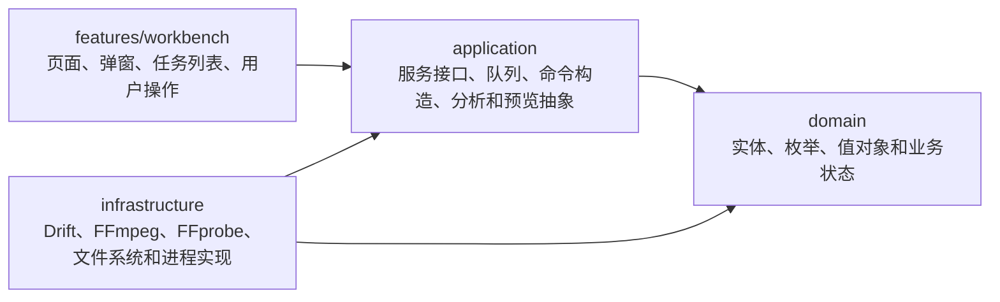

# Machining 架构说明

## 文档目的

这个文件记录 Machining 当前项目架构、核心模块解析，以及为什么采用这种架构。

这里描述的是当前代码事实，不记录产品规划或历史开发日志。测试和构建说明看 `docs/develop/test-plan.md`，文档总入口看 `docs/README.md`。

## 架构总览

Machining 是一个本地视频压缩桌面应用。当前主路径是：用户导入本地视频，应用使用 FFprobe 分析媒体信息，按任务配置构造 FFmpeg 命令，在本机执行压缩或转封装，并把任务状态持久化到本地 SQLite。

项目采用接近 Clean Architecture 的分层方式：

```text
features -> application -> domain
                  |
                  v
            infrastructure
```



依赖方向约束：

- `domain` 不依赖 Flutter、Drift、FFmpeg 或文件系统。
- `application` 定义服务抽象、仓储接口和核心流程，可以依赖 `domain`。
- `infrastructure` 实现数据库、文件系统、FFmpeg / FFprobe 和平台差异，可以依赖 `application` 抽象和 `domain`。
- `features` 是 UI 和页面状态协调层，通过 Riverpod 读取仓储和服务。
- `app` 只负责应用入口、主题和路由，不承载业务规则。

## 为什么使用这个架构

- UI 和业务规则分离：工作台页面可以改版，而任务状态、命令构造和队列执行不需要跟着重写。
- 便于测试：FFmpeg 命令构造、压缩估算、队列执行和媒体分析可以脱离 Flutter 页面单独测试。
- 便于跨平台：macOS 和 Windows 的 FFmpeg 路径、文件管理器打开方式和编码器能力差异集中在 infrastructure。
- 便于恢复和校正任务状态：任务实体和数据库模型清晰分离，应用重启后可以从本地 SQLite 重新读取任务并检查源文件。
- 便于替换实现：未来如果调整 FFmpeg 运行时、日志系统或数据库策略，可以优先替换 infrastructure 层。

## 源码目录

```text
lib/
  main.dart
  app/
    app.dart
    app_router.dart
  domain/
    entities/
    enums/
    value_objects/
  application/
    repositories/
    services/
  infrastructure/
    database/
    providers/
    repositories/
    services/
  features/
    workbench/
      pages/
      providers/
      widgets/
```

平台与工程目录：

```text
macos/
windows/
linux/
web/
test/
scripts/
third_party/
docs/
```

当前验证和发布重点是 macOS Apple Silicon 与 Windows x64。Linux 和 Web 目录来自 Flutter 工程模板，不代表已经完成产品级支持。

## 核心模块解析

### app

`app` 保存应用外壳：

- `MachiningApp`：创建 `MaterialApp.router`，配置主题、字体、按钮圆角和图标尺寸。
- `appRouter`：使用 GoRouter。当前 `/` 指向 `WorkbenchPage`，应用设置通过工作台弹窗打开。
- `main.dart`：初始化 Flutter binding，创建 Riverpod `ProviderScope`。

### domain

`domain` 保存不依赖 Flutter UI 的业务模型：

- `MediaTask`：媒体任务主实体。
- `AppSettings`：应用级设置实体。
- `VideoTaskConfig`：单个视频任务的输出和压缩配置。
- `MediaAnalysisResult`：FFprobe 分析结果。
- `SourceFileFingerprint`：源文件快速指纹，用于检测源文件是否被替换或移动。
- 枚举：任务状态、输出格式、视频编码、编码器后端、分辨率预设、压缩模式、智能压缩预设、媒体类型、任务用途等。

`MediaTask` 是任务状态流转的核心。它提供 `markRunning`、`markPaused`、`markCompleted`、`markFailed`、`markCancelled`、`markMissingSource`、`replaceInputFile`、`withAnalysisResult` 等方法，避免 UI 或仓储直接拼装状态。

### application

`application` 保存服务接口和核心业务流程：

- `FfmpegCommandBuilder`：根据任务配置生成 FFmpeg 参数。
- `FfmpegTaskQueueRunner`：串行执行任务，处理启动、暂停、继续、取消和队列连续执行。
- `FfmpegProcessObserver`：解析 FFmpeg 输出并更新进度。
- `MediaAnalyzer`：分析媒体信息。
- `PreviewFrameGenerator`：生成压缩前后预览帧。
- `CompressionAdvisor` 和 `CompressionEstimator`：给出压缩策略和体积预估。
- `FfmpegEncoderCapabilities`：解析和判断当前 FFmpeg 支持的软件 / 硬件编码器。
- `FfmpegLocator`：描述 FFmpeg / FFprobe 运行时解析接口。
- `SourceFileChecker`、`SourceFileFingerprintReader`、`MediaKindResolver`：把文件系统和扩展名识别能力抽象出来。
- Repository 接口：隔离业务层和 Drift 数据库实现。

### infrastructure

`infrastructure` 保存本地实现：

- Drift + SQLite 数据库。
- Riverpod provider 组装数据库、仓储和服务实现。
- FFmpeg / FFprobe 定位和自定义路径校验。
- FFmpeg 编码器能力检测。
- FFprobe 媒体分析实现，解析 JSON 输出。
- 压缩建议默认实现。
- FFmpeg 命令构造默认实现。
- FFmpeg 进程启动和进度观测。
- 本地缩略图、预览帧和源文件指纹读取。
- macOS、Windows、Linux 文件管理器打开方式和平台差异处理。

### features/workbench

`features/workbench` 是当前主要 UI 功能区：

- 工作台页面。
- 顶部栏、底部栏、任务列表、预览区、文件信息、导出路径、质量和视频配置面板。
- 任务配置弹窗。
- `MediaTaskListNotifier` 协调 UI 操作、任务持久化、源文件检查、后台分析和队列状态刷新。

工作台当前支持：

- 文件选择和拖拽导入。
- 任务列表、排序、右键菜单、重命名、删除和清空。
- 源文件丢失后的重新指定。
- 任务配置保存。
- 单任务开始 / 暂停 / 继续 / 重试。
- 队列启动和连续执行。
- 完成、失败和分析错误提示。
- 缩略图和压缩前后预览帧。

## Riverpod 组装方式

Machining 使用 Riverpod 作为依赖注入和状态管理工具。

核心 provider：

| Provider | 类型 | 职责 |
| --- | --- | --- |
| `appDatabaseProvider` | `Provider<AppDatabase>` | 提供全局唯一数据库实例，容器释放时关闭 |
| `mediaTaskRepositoryProvider` | `Provider<MediaTaskRepository>` | 提供 Drift 任务仓储 |
| `appSettingsRepositoryProvider` | `Provider<AppSettingsRepository>` | 提供 Drift 设置仓储 |
| `ffmpegRuntimeProvider` | `AsyncNotifierProvider` | 解析并缓存 FFmpeg / FFprobe 运行时和编码器能力 |
| `ffmpegTaskQueueRunnerProvider` | `Provider<FfmpegTaskQueueRunner>` | 维持同一个队列执行器实例 |
| `mediaTaskListProvider` | `AsyncNotifierProvider` | 工作台任务列表、导入、分析、刷新和任务操作 |

服务实现通常通过 provider 暴露抽象接口，例如 UI 只读取 `mediaTaskRepositoryProvider`、`ffmpegTaskQueueRunnerProvider`、`previewFrameGeneratorProvider`，不直接创建 Drift 或 FFmpeg 实现。

## 主要流程

### 应用启动

```text
main()
  -> ProviderScope
  -> MachiningApp
  -> GoRouter("/")
  -> WorkbenchPage
  -> mediaTaskListProvider.build()
  -> loadAllTasks()
  -> 检查源文件和指纹
  -> 必要时后台分析
  -> 刷新 FFmpeg 队列状态
```

启动时只恢复数据库里的任务状态，不恢复旧 FFmpeg 进程句柄。任务会根据源文件现状做一次校正：源文件丢失会进入 `missingSource`，缺少分析结果会进入后台分析，已有 `pending` 或 `paused` 任务会让队列进入 ready；如果数据库中残留 `running` 状态，当前队列状态会按 running 处理，后续中断恢复逻辑需要特别注意这一点。

### 导入文件和后台分析

```text
文件选择 / 拖拽
  -> MediaKindResolver 按扩展名识别类型
  -> 当前只允许 video
  -> SourceFileFingerprintReader 读取文件大小和修改时间
  -> MediaTask.draft()
  -> 保存 analyzing 任务
  -> FfprobeMediaAnalyzer.analyze()
  -> 写入 MediaAnalysisResult
  -> 状态回到 pending
```

如果 FFprobe 不可用或分析失败，任务会保存 `analysis_error_message` 并标记为 `failed`。如果源文件在分析前丢失，任务会标记为 `missingSource`。

### 预览和缩略图

缩略图由 `LocalVideoThumbnailGenerator` 生成，工作台用任务和文件状态组成 key，避免重复生成失败缩略图。

压缩预览由 `LocalPreviewFrameGenerator` 生成：

1. 根据任务、配置、分析结果、压缩建议和编码器能力生成 `PreviewFrameFingerprint`。
2. 默认在视频 5%、27.5%、50%、72.5%、95% 位置取样。
3. 每个点先抽原始帧，再生成 1 秒压缩片段，然后从压缩片段抽对比帧。
4. 预览目录位于系统临时目录 `machining/previews/<taskId>`。

### FFmpeg 命令构造

`DefaultFfmpegCommandBuilder` 只负责构造计划，不启动进程。

命令计划包含：

- `args`：最后一步或单步 FFmpeg 参数。
- `steps`：一个或多个 `FfmpegCommandStep`。
- `outputPath`：输出文件路径。
- `cleanupPathPrefixes`：需要清理的临时文件前缀。
- `logHint`：供日志或 UI 展示的策略摘要。

主要规则：

- 当前只支持 `MediaKind.video`。
- `VideoCodec.source` 必须先依赖分析结果解析为 `h264` 或 `hevc`。
- `EncoderBackend.auto` 会根据 FFmpeg 实际支持和平台优先级选择硬件编码或软件编码。
- 输出目录为空时使用源文件目录。
- 自定义输出文件名会取 basename 并替换扩展名。
- 如果输出路径和源文件相同，或目标文件已存在，会自动追加 `-1`、`-2` 等后缀。
- `targetSize` 模式在软件编码下使用两遍压缩，在硬件编码下使用目标码率单遍策略。

### 队列执行

`DefaultFfmpegTaskQueueRunner` 是 FFmpeg 执行的核心协调器。它保存内存中的 `_executions` 和 `_foregroundTaskId`，同时把任务状态写回仓储。

状态模型：

| 队列状态 | 含义 |
| --- | --- |
| `idle` | 没有可执行或正在执行的任务 |
| `ready` | 存在 `pending` 任务或暂停中的进程 |
| `running` | 存在前台执行任务或数据库中有 `running` 任务 |

执行流程：

```text
start / startOrResumeTask
  -> 检查队列和任务状态
  -> 检查源文件
  -> 解析 FFmpeg 运行时
  -> 构造命令计划
  -> 创建执行日志文件
  -> markRunning()
  -> LocalFfmpegProcessStarter.start()
  -> LocalFfmpegProcessObserver.observe()
  -> 根据退出结果 markCompleted() 或 markFailed()
  -> 清理两遍压缩临时文件
  -> continueAfterTask()
```

暂停和恢复：

- 暂停当前前台任务时，当前实现直接向进程发送 `ProcessSignal.sigstop`，并把任务标记为 `paused`。
- 恢复暂停任务时发送 `ProcessSignal.sigcont`，并标记为 `running`。
- 切换到另一个任务前，会先挂起当前前台任务。

取消：

- 取消单任务会 kill 对应进程，移除内存执行记录，清理计划临时文件，并标记为 `cancelled`。
- 清空任务会调用 `cancelAllExecutions()`，再用仓储清空 `tasks`。

连续执行：

- 当前 `continuousExecutionEnabled` 默认开启。
- 一个任务完成或失败后，队列会按 `sort_order` 和 `created_at` 找下一个 `pending` 任务继续执行。

### 进度和日志

`DefaultFfmpegCommandBuilder` 给执行命令加入：

```text
-progress pipe:1
```

`LocalFfmpegProcessObserver` 读取 stdout 中的 `out_time_ms`，结合 `analysis_duration_ms` 计算进度。stderr 被写入本次执行日志文件。

日志路径由 provider 中的 `createFfmpegExecutionLogFilePath()` 生成：

```text
<system temp>/machining/ffmpeg-logs/<timestamp>_<taskId>_<safeFileName>.log
```

## FFmpeg 运行时边界

`LocalFfmpegLocator` 负责解析运行时，顺序是：

1. 用户设置的自定义路径。
2. 应用包或可执行文件旁边的 bundled 路径。
3. macOS / Linux 常见系统路径。
4. `which` 或 Windows `where` 找到的 PATH 工具。

解析到 FFmpeg 后会读取 `-encoders` 输出，生成 `FfmpegEncoderCapabilities`。如果读取失败，会使用 bundled fallback 能力，至少假设 `libx264` 可用。

## 数据持久化边界

Drift 数据库只保存可恢复的业务状态：

- 任务身份、源文件路径、文件名、排序。
- 任务状态、进度、输出路径和错误信息。
- 输出格式、编码、后端、分辨率、压缩模式、目标体积、自定义文件名。
- 源文件指纹。
- FFprobe 分析结果。
- 应用设置和自定义 FFmpeg / FFprobe 路径。

不入库的数据：

- FFmpeg 原始执行日志。
- 预览帧和缩略图文件。
- 两遍压缩 pass log。
- 完整 FFprobe JSON。
- 内存中的暂停进程句柄。

详细字段见 `docs/develop/data-model.md`。

## 平台边界

当前平台事实：

| 平台 | 当前状态 | 说明 |
| --- | --- | --- |
| macOS Apple Silicon | 主要验证平台 | 可内置 macOS arm64 FFmpeg，支持 VideoToolbox 自动优先级 |
| Windows x64 | 主要验证平台 | Release 构建要求内置 `ffmpeg.exe` / `ffprobe.exe`，支持 NVENC / QSV / AMF 自动优先级 |
| Linux | 工程目录存在 | 本地工具路径解析有 Linux 分支，但不是当前发布目标 |
| Web | 工程目录存在 | FFmpeg 本地进程路线不适用于 Web，当前不支持发布 |

## 错误处理和恢复原则

- 源文件不存在优先标记为 `missingSource`，让用户重新指定文件。
- FFprobe 不可用或分析失败会写入分析错误，并让任务进入 `failed`。
- FFmpeg 不可用、命令构造失败、进程启动失败、退出码失败或输出文件缺失都会让任务进入 `failed`。
- 低码率视频再次压缩可能变大时，压缩建议会触发确认异常，UI 可让用户确认后带 `allowExtremeCompression` 重试。
- 两遍压缩临时文件清理是 best-effort，不应让最终任务因为清理失败而失败。
- 应用重启后只从数据库恢复任务状态，不恢复旧进程；涉及 `running` 残留状态时要先设计清晰的恢复或重置策略。

## 测试定位

当前自动化测试主要覆盖 application 和 infrastructure 服务：

```text
test/compression_advisor_test.dart
test/compression_estimator_test.dart
test/ffmpeg_command_builder_test.dart
test/ffmpeg_encoder_capabilities_test.dart
test/ffmpeg_process_observer_test.dart
test/ffmpeg_task_queue_runner_test.dart
test/ffprobe_media_analyzer_test.dart
test/preview_frame_generator_test.dart
test/video_thumbnail_generator_test.dart
test/widget_test.dart
```

新增架构能力时，优先给 application 服务或 infrastructure 实现补单元测试；UI 层只保留基础 Widget 构建和关键交互测试。

## 当前架构文档

- `technology-stack.md`：技术栈、开发环境和主要目录说明。
- `data-model.md`：当前数据库、任务模型和设置模型。

## 给 AI 的使用说明

处理代码任务时，优先阅读本文档和 `data-model.md`。如果任务涉及产品范围，先读 `docs/README.md` 的产品部分和 `docs/product/roadmap.md`；如果任务涉及测试或构建，再读 `docs/develop/test-plan.md` 和 `docs/README.md` 的测试 / 构建部分。
