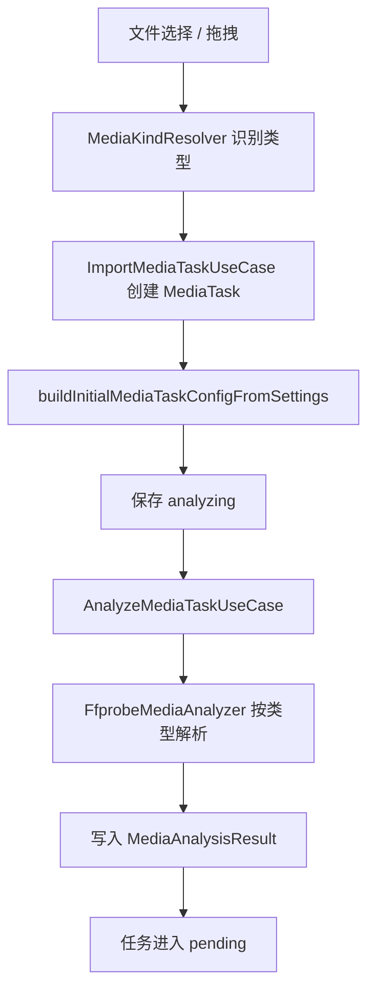
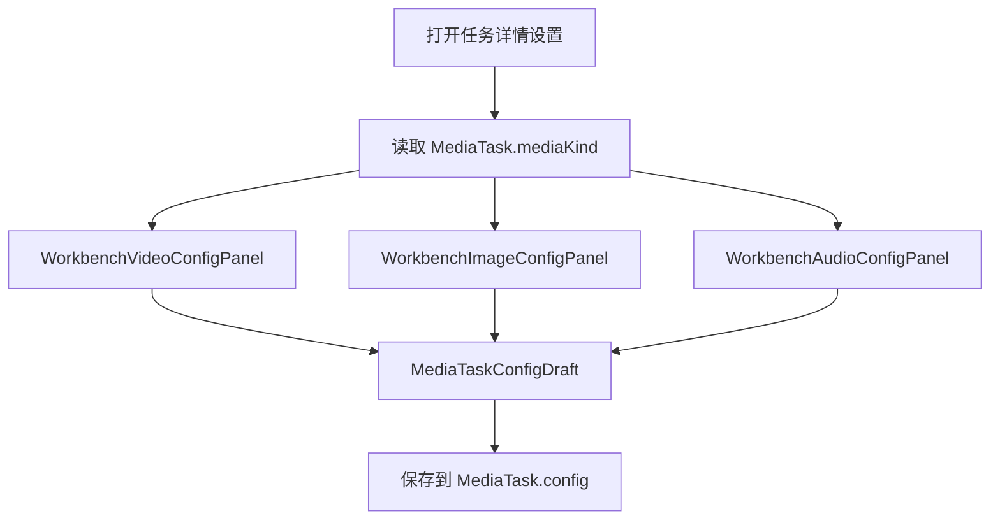
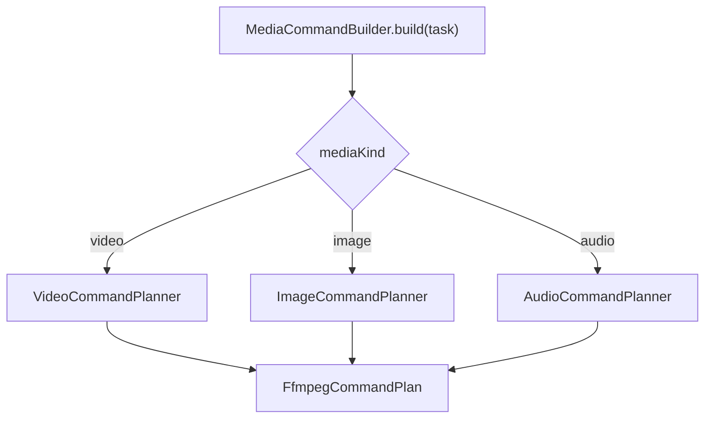

# media-processing — 设计报告

> 关联分析：上一轮对话中的“多媒体处理扩展 — 功能分析”（未落盘）。

## 1. 目标

把 FrameLean 从“只能处理视频的桌面压缩应用”扩展为“可处理视频、图片、音频的本地媒体处理工作台”，同时把主领域模型、应用服务、工作台 UI 和持久化命名从 `Video...` 收敛为通用 `Media...`。

本设计的目标不是一次性做成完整媒体编辑器，而是让当前压缩 / 转码主链路具备三类媒体的稳定基础：

- 视频：保持当前压缩、转封装、分辨率、H.264 / HEVC、硬件编码能力。
- 图片：支持单张图片导入、基础压缩、格式转换、尺寸调整和输出路径管理。
- 音频：支持单个音频文件导入、基础压缩、格式转换、码率 / 采样率 / 声道配置和输出路径管理。
- 通用：任务列表、状态恢复、源文件重新指定、队列执行、日志、完成弹窗和打开输出位置继续复用现有工作台体验。
- 命名：用户可见产品文案、domain 主模型、application 抽象和 features 主入口不再以 `VideoTaskConfig`、`VideoThumbnailGenerator`、`WorkbenchVideoConfigPanel` 作为通用能力名。

## 2. 现状分析

当前项目已经有一些通用媒体基础，但主行为仍是视频专用。

已有基础：

- `MediaTask` 是任务主实体，已经使用 `mediaKind` 区分媒体类型。
- `MediaKind` 已包含 `video`、`image`、`audio`。
- `FileExtensionMediaKindResolver` 已按扩展名识别视频、图片和音频。
- 任务仓储、任务状态、源文件指纹、重新指定源文件、队列执行器和输出路径管理大体可以继续复用。
- FFmpeg / FFprobe 运行时定位、执行日志、进程启动和跨平台暂停 / 继续 / 终止能力已经集中在 infrastructure 层。

当前限制：

- `ImportMediaTaskUseCase` 通过 `ensureSupportedImportedMediaKind` 拒绝非视频文件。
- `MediaTask.config` 类型是 `VideoTaskConfig`，字段包含 `videoCodec`、`encoderBackend`、`resolutionPreset` 等视频专用配置。
- Drift `tasks` 表配置字段是视频结构：`video_codec`、`resolution_preset`、`compression_crf`、`smart_preset` 等。
- `FfprobeMediaAnalyzer.parseResult` 要求存在视频流；纯音频和静态图片会分析失败。
- `DefaultFfmpegCommandBuilder`、`FfmpegEncoderResolver` 和 `FfmpegVideoArgumentBuilder` 固定构造 `0:v:0`、`-c:v`、`-vf`、视频编码器、视频滤镜和视频兼容参数。
- `SourceCompressionAssessor`、`DefaultCompressionAdvisor`、`DefaultCompressionEstimator` 使用视频码率、视频高度、H.264 / HEVC 效率和音频扣除逻辑，不能直接复用于图片和纯音频。
- 工作台入口、文件选择器、拖拽失败提示、空态、配置面板、完成弹窗、关于弹窗和多项测试仍使用“视频 / 压缩”前提。
- `LocalFfmpegProcessObserver` 根据 FFmpeg `out_time_ms` 和 `analysis_duration_ms` 计算进度；图片处理通常没有可用时长，需要步骤型进度兜底。

文档与代码冲突：

- `docs/develop/data-model.md` 写当前 schema version 为 `13`，`docs/develop/technology-stack.md` 中数据库行仍写 schema version 为 `12`。代码里的 `AppDatabase.schemaVersion` 是 `13`，因此技术栈文档此处滞后，后续实现需要同步修正。

### 方案比较

| 方案 | 产品影响 | 维护性 | 测试性 | 迁移成本 | 结论 |
| --- | --- | --- | --- | --- | --- |
| A. 只放开图片 / 音频扩展名 | 看似最快，但导入后会在分析或命令构造失败 | 最差，错误从显式拒绝变成深层失败 | 难以定义稳定验收 | 低但不可用 | 不采用 |
| B. 在现有 `VideoTaskConfig` 中继续塞图片 / 音频字段 | 可以较快接 UI，但命名和模型长期混乱 | 差，主模型仍以视频为中心 | 测试会混合大量条件分支 | 中 | 不采用 |
| C. 建立 `MediaTaskConfig`，内部按 media kind 持有分类型配置 | 产品、命名、领域模型一致，旧视频能力可迁移 | 最好，视频 / 图片 / 音频边界清楚 | 可按类型拆单测和 widget 测试 | 中高 | 采用 |
| D. 为视频、图片、音频建立三套完全独立任务实体和仓储 | 单类型边界极清晰 | 过度拆分，队列和 UI 复用变差 | 测试数量膨胀 | 高 | 不采用 |

推荐方案是 C：保留 `MediaTask` 作为统一任务实体，新增通用 `MediaTaskConfig`，其内部包含通用字段和分类型配置。这样既能保留现有工作台、任务队列、仓储和状态恢复的优势，又能逐步去除主链路里的 `Video...` 命名。

## 3. 数据模型与接口

### 3.1 Domain 模型

新增或重命名：

```text
lib/domain/value_objects/media_task_config.dart
lib/domain/value_objects/video_processing_config.dart
lib/domain/value_objects/image_processing_config.dart
lib/domain/value_objects/audio_processing_config.dart
lib/domain/enums/media_output_format.dart
lib/domain/enums/video_codec.dart
lib/domain/enums/image_codec.dart
lib/domain/enums/audio_codec.dart
lib/domain/enums/media_processing_preset.dart
```

`MediaTask` 调整：

```dart
class MediaTask {
  final MediaKind mediaKind;
  final TaskPurpose purpose;
  final MediaTaskConfig config;
  final MediaAnalysisResult? analysisResult;
}
```

`MediaTaskConfig` 建议结构：

```dart
class MediaTaskConfig {
  final String outputDirectory;
  final String outputFileName;
  final CompressionMode compressionMode;
  final MediaProcessingPreset? preset;
  final int? targetSizeBytes;
  final double? targetSizeRatio;
  final VideoProcessingConfig? video;
  final ImageProcessingConfig? image;
  final AudioProcessingConfig? audio;
}
```

约束：

- `MediaTask.mediaKind == MediaKind.video` 时，`config.video` 必须存在。
- `MediaTask.mediaKind == MediaKind.image` 时，`config.image` 必须存在。
- `MediaTask.mediaKind == MediaKind.audio` 时，`config.audio` 必须存在。
- `domain` 只表达配置和状态，不依赖 Flutter、Drift、FFmpeg、文件系统或平台。

### 3.2 分类型配置

视频配置：

- `outputFormat`: `mp4`、`mov`、`mkv`。
- `videoCodec`: `source`、`h264`、`hevc`。
- `encoderBackend`: `auto`、`libx264`、`libx265`、`videotoolbox`、`nvenc`、`qsv`、`amf`。
- `resolutionPreset`: `original`、`2160p`、`1080p`、`720p`、`480p`。
- `crf`: 保留当前视频质量参数。

图片配置：

- `outputFormat`: `jpg`、`png`、`webp`。
- `imageCodec`: `source`、`jpeg`、`png`、`webp`。
- `imageQuality`: 1 到 100，默认由预设映射。
- `imageResizePreset`: `original`、长边 3840、2560、1920、1280、720，或后续自定义尺寸。
- `preserveMetadata`: 首版默认 `false`，避免泄露 EXIF；如需保留另设开关。

音频配置：

- `outputFormat`: `mp3`、`m4a`、`aac`、`wav`、`flac`。
- `audioCodec`: `source`、`aac`、`mp3`、`opus`、`flac`、`pcm`。
- `audioBitratePreset`: `source`、`320k`、`192k`、`128k`、`96k`、`64k`。
- `audioSampleRate`: `source`、`48000`、`44100`、`32000`。
- `audioChannels`: `source`、`stereo`、`mono`。

### 3.3 MediaAnalysisResult

保留当前类名，但扩展为真正通用媒体分析结果。字段分组建议：

```text
通用：durationMs, containerFormat, containerBitrate, estimatedBitrate, fileSize
视频：videoWidth, videoHeight, videoCodec, videoBitrate, pixelFormat, color...
音频：audioCodec, audioBitrate, audioChannels, audioSampleRate, audioChannelLayout, audioStreamIndex
图片：imageWidth, imageHeight, imageCodec, imagePixelFormat, imageBitDepth, orientationDegrees
```

实现策略：

- 纯音频不要求视频流；使用音频流和 format duration。
- 静态图片不要求 duration；使用图片视频流中的宽高、像素格式、编码或 `format_name` 作为图片分析依据。
- 如果 FFprobe 对某些图片无法给出完整信息，允许分析结果只包含文件大小、容器格式和图片尺寸中的一部分，但任务仍可进入 `pending`。

### 3.4 Drift 持久化

推荐采用渐进迁移，避免一次性物理重命名旧列带来的历史数据风险。

阶段一：

- 保留现有 `tasks` 表旧列。
- 新增通用列：
  - `media_config_json`：保存 `MediaTaskConfig` 的版本化 JSON。
  - `analysis_image_width`
  - `analysis_image_height`
  - `analysis_image_codec`
  - `analysis_image_pixel_format`
  - `analysis_image_bit_depth`
- 新增 `PersistenceCompatibility` 常量，集中记录旧 `video_*` 字段与新 JSON 的兼容读取规则。

读取规则：

1. 如果 `media_config_json` 存在，优先读取新配置。
2. 如果不存在，按旧视频列构造 `MediaTaskConfig.video`。
3. 保存任务时写入 `media_config_json`，同时在首个兼容版本继续写旧视频列，保证旧测试和迁移期间回滚风险可控。

阶段二：

- 等新版本稳定后，再评估是否停止写旧列。不要在本功能首版删除旧列。

`settings` 表调整：

- 保留 `default_output_video_codec` 作为旧字段。
- 新增 `default_media_config_json` 或分类型默认配置字段。
- `AppCompressionSettings` 改名为 `AppMediaProcessingSettings`，并保留旧 getter 的兼容期，减少一次性 UI 改动。

### 3.5 Application 接口

新增或重命名服务抽象：

```text
MediaCommandBuilder
MediaCommandPlanner
MediaProcessingAdvisor
MediaProcessingEstimator
MediaThumbnailGenerator
MediaPreviewGenerator
MediaProgressObserver
```

视频专用实现可以保留：

```text
VideoCommandPlanner
ImageCommandPlanner
AudioCommandPlanner
VideoProcessingAdvisor
ImageProcessingAdvisor
AudioProcessingAdvisor
VideoPreviewGenerator
ImagePreviewGenerator
AudioPreviewGenerator
```

命名原则：

- application 抽象使用 `Media...`。
- infrastructure 内部实现允许出现 `Video...`、`Image...`、`Audio...`，但只代表具体分支，不代表主接口。
- UI 主入口使用 `Media...`，类型分面板使用 `Video...` / `Image...` / `Audio...`。

## 4. 核心流程

### 4.1 导入和分析



关键设计：

- 文件选择器改为 `pickMediaFiles()`，同时注册视频、图片、音频类型组。
- 拖拽仍拒绝文件夹，但文案改为“只能导入媒体文件，不能导入文件夹”。
- 不支持的扩展名继续在 `MediaKindResolver` 层失败，而不是进入 FFmpeg 执行阶段才失败。
- 重新指定源文件时仍要求 `newMediaKind == task.mediaKind`，避免用音频替换视频任务。

### 4.2 配置弹窗



关键设计：

- `WorkbenchTaskConfigurationDialog` 保留弹窗外壳、源文件摘要、目标体积模式和保存动作。
- `WorkbenchVideoConfigPanel` 改名或上移为 `WorkbenchMediaConfigPanel`，内部按类型组合分面板。
- 图片任务显示：图片格式、质量、尺寸。
- 音频任务显示：音频格式、编码、码率、采样率、声道。
- 视频任务保持现有控件和推荐预设。
- “已修改”判断改为 `MediaTaskAdjustmentPolicy`，按媒体类型比较源分析结果与配置。

### 4.3 命令规划



视频规划：

- 从现有 `DefaultFfmpegCommandBuilder`、`FfmpegEncoderResolver`、`FfmpegVideoArgumentBuilder` 迁移而来。
- 保留两遍目标体积、硬件编码、HDR 降级、主音频流选择、`-movflags +faststart`。

图片规划：

- 输入：单张图片。
- 输出：目标图片格式。
- JPEG / WebP 使用质量参数，PNG 首版使用压缩级别或默认无损参数。
- 尺寸调整使用 `scale`，按长边限制并保持宽高比。
- 图片命令不强制 `-progress pipe:1` 产生有效时长进度；计划可声明 `progressMode: step`.

音频规划：

- 输入：音频或带音频的媒体文件首版只支持 `mediaKind.audio`。
- 输出：目标音频格式。
- 使用 `-vn` 禁用视频流。
- 按配置设置 `-c:a`、`-b:a`、`-ar`、`-ac`。
- 音频有 duration 时继续使用 `out_time_ms` 计算进度。

### 4.4 执行和进度

`FfmpegTaskQueueRunner` 可继续作为执行器，但建议主接口逐步改名为 `MediaTaskQueueRunner` 或保留 `FfmpegTaskQueueRunner` 作为实现细节：

- 如果未来所有处理仍依赖 FFmpeg，`FfmpegTaskQueueRunner` 可以短期保留。
- 如果要让 application 主接口更通用，应新增 `MediaTaskQueueRunner` 抽象，由 `DefaultFfmpegTaskQueueRunner` 实现。

`FfmpegCommandPlan` 增加：

```dart
enum ProgressMode { timed, step }

class FfmpegCommandStep {
  final ProgressMode progressMode;
}
```

观测规则：

- `timed`：继续按 `out_time_ms / duration` 更新。
- `step`：启动步骤后可显示当前步骤的固定进度，步骤完成后推进到下一段；单步图片任务完成前不承诺连续百分比。
- 完成和失败状态继续由退出码和输出文件是否存在决定。

### 4.5 缩略图和预览

任务列表缩略图：

- `VideoThumbnailGenerator` 改为 `MediaThumbnailGenerator`。
- 视频：继续抽非黑帧。
- 图片：直接使用源图或生成小尺寸缓存图。
- 音频：首版使用类型占位图和文件信息，不做波形图。

完成弹窗：

- 标题从“压缩完成”改为“处理完成”或按任务用途显示“压缩完成 / 转换完成”。
- 体积指标从“压缩前 / 压缩后”改为“源文件 / 输出文件”。
- 输出路径、打开文件位置继续复用。

压缩前后预览：

- 视频继续保留对比帧预览。
- 图片可提供原图 / 输出图对比，但首版可暂不做，避免引入图片对比交互复杂度。
- 音频首版不做波形或试听对比，只保留输出体积和路径。

## 5. 项目结构与技术决策

### 5.1 推荐结构

```text
lib/domain/
  enums/
    media_kind.dart
    media_output_format.dart
    video_codec.dart
    image_codec.dart
    audio_codec.dart
  value_objects/
    media_task_config.dart
    video_processing_config.dart
    image_processing_config.dart
    audio_processing_config.dart
    media_analysis_result.dart

lib/application/
  services/
    input_runtime/
      media_analyzer.dart
      media_kind_resolver.dart
    ffmpeg_planning/
      media_command_builder.dart
      media_processing_advisor.dart
      media_processing_estimator.dart
    execution/
      media_thumbnail_generator.dart
      media_preview_generator.dart
      media_task_queue_runner.dart

lib/infrastructure/
  services/
    input_runtime/
      ffprobe_media_analyzer.dart
    ffmpeg_planning/
      default_media_command_builder.dart
      video_command_planner.dart
      image_command_planner.dart
      audio_command_planner.dart
    execution/
      local_media_thumbnail_generator.dart
      local_video_thumbnail_generator.dart
      local_image_thumbnail_generator.dart
      local_audio_thumbnail_generator.dart

lib/features/workbench/
  pages/workbench_page/dialogs/
    media_config_panel.dart
    video_config_panel.dart
    image_config_panel.dart
    audio_config_panel.dart
```

### 5.2 技术决策

1. 保留 `MediaTask`，不拆三套任务实体。
   - 原因：任务列表、排序、状态恢复、队列执行、源文件指纹和输出管理是通用能力，拆实体会增加 UI 和仓储复杂度。

2. 使用 `MediaTaskConfig` 承接通用配置，视频字段下沉。
   - 原因：主链路命名必须通用，视频能力作为一种媒体类型存在。

3. Drift 首版新增 JSON 配置列，而不是删除旧视频列。
   - 原因：当前历史字段多，直接重命名或删除会显著增加迁移风险；JSON 配置能承接分类型结构，同时旧列可兼容读取。

4. `MediaAnalysisResult` 保持单一结果对象，但字段分组。
   - 原因：现有 UI、估算和仓储已经依赖该对象。拆成三套结果会让仓储映射和任务列表显示成本变高。

5. FFmpeg 命令规划按 media kind 分派。
   - 原因：视频、图片、音频参数差异大；继续在一个 `FfmpegVideoArgumentBuilder` 里加条件会失控。

6. 图片首版使用步骤进度。
   - 原因：静态图片没有可靠时长，伪造连续百分比反而降低可信度。

7. 音频首版不做波形预览。
   - 原因：波形生成、缓存和交互是独立功能；当前需求重点是导入、配置、处理和输出。

### 5.3 文档同步

实现阶段会影响以下文档：

- `docs/README.md`：产品定位从视频压缩更新为媒体处理。
- `docs/develop/architecture.md`：更新 domain、application、infrastructure、features 模块说明。
- `docs/develop/data-model.md`：更新 schema version、`MediaTaskConfig`、新配置字段和迁移规则。
- `docs/develop/test-plan.md`：补充图片 / 音频导入、分析、命令构造、进度和 UI 验证。
- `docs/develop/technology-stack.md`：修正 schema version 滞后，并更新媒体类型边界。
- `docs/product/roadmap.md`：标记多媒体处理为规划或已完成，取决于实现阶段状态。

## 6. 分支建议

| 分支名 | 适用理由 | 风险 |
| --- | --- | --- |
| `feature/media-processing` | 最直接表达把工作流扩展到通用媒体处理 | 范围偏大，容易把图片 / 音频全部能力一次性塞入 |
| `feature/multimedia-task-config` | 强调先做模型和配置泛化，可作为分阶段第一支 | 名字偏技术，用户可见功能不够明确 |
| `feature/image-audio-processing` | 强调新增图片和音频能力 | 容易忽略同时需要清理 `Video...` 主命名 |
| `feature/media-workbench` | 强调工作台产品层升级 | 可能被误解为纯 UI 改版 |

推荐：`feature/media-processing`。如果实现时希望降低风险，可以把第一阶段拆为 `feature/multimedia-task-config`，先完成模型和视频兼容，再在后续分支加入图片 / 音频执行能力。

## 7. 验收标准

| 验收条件 | 验收方式 |
| --- | --- |
| 视频任务旧数据可读取，旧视频压缩行为不回退 | 仓储兼容测试、`ffmpeg_command_builder_test.dart`、视频手动压缩 |
| `MediaTask.config` 主类型不再是 `VideoTaskConfig` | 静态搜索 `MediaTask` 主实体和仓储 mapper |
| 非视频导入不再在 import 阶段被拒绝 | `ImportMediaTaskUseCase` 单元测试覆盖 video/image/audio |
| 纯音频 FFprobe 分析可生成 `MediaAnalysisResult` | `ffprobe_media_analyzer_test.dart` 增加纯音频样例 |
| 静态图片 FFprobe 分析可生成图片尺寸或可用的部分分析结果 | `ffprobe_media_analyzer_test.dart` 增加图片样例 |
| 视频 / 图片 / 音频可分别生成合法 FFmpeg 命令计划 | 新增或扩展命令构造测试 |
| 图片任务执行时不会因缺少 duration 卡住进度 | 进度观测或队列执行测试覆盖 `ProgressMode.step` |
| 音频任务执行时使用 `-vn`，不会输出视频流 | 命令构造测试检查参数 |
| 图片任务执行时输出格式和质量参数符合配置 | 命令构造测试检查 jpg/webp/png 参数 |
| 工作台文件选择支持视频、图片、音频类型组 | Widget 或轻量单测检查 `WorkbenchConstants` |
| 配置弹窗按媒体类型展示不同配置面板 | Widget 测试覆盖三类任务 |
| 任务列表缩略图对视频、图片、音频都有稳定表现 | 缩略图 generator 测试和 Widget 测试 |
| 完成弹窗使用通用“源文件 / 输出文件”文案 | Widget 测试检查不再硬编码“压缩前 / 压缩后”作为唯一文案 |
| 文档同步到当前产品定位和数据模型 | 文档 diff 审查 |
| Dart / Flutter 检查通过 | `git ls-files '*.dart' \| xargs dart format --set-exit-if-changed`、`flutter analyze`、`flutter test` |

## 8. 暂不实现

| 功能 | 理由 | 是否预留扩展 |
| --- | --- | --- |
| 文件夹递归批量导入 | 涉及过滤、重复、权限、失败汇总和大量任务性能 | 是 |
| GIF 动图专门优化 | GIF 可能是图片也可能类似视频，压缩策略复杂 | 是 |
| 图片 EXIF 编辑或水印 | 超出压缩 / 转换主线 | 是 |
| 音频裁剪、淡入淡出、音量标准化 | 属于音频编辑能力，不是首版处理能力 | 是 |
| 音频波形预览和试听对比 | 需要额外缓存、渲染和播放器交互 | 是 |
| 多音轨选择和字幕处理 | 当前视频主链路已只保留主可转码音频流，扩展多轨会扩大范围 | 是 |
| 新增后端服务或云端处理 | 当前产品是本地 Flutter 桌面应用，无真实服务/API surface | 否 |
| 立即删除旧 `video_*` 数据库列 | 会增加历史数据迁移和回滚风险 | 是 |
| Linux / Web 发布级支持 | 当前技术文档明确主要验证平台是 macOS Apple Silicon 和 Windows x64 | 是 |
