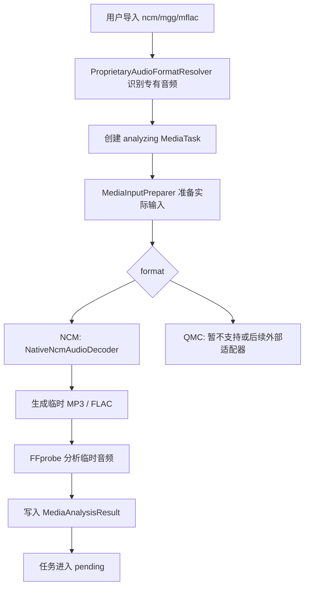
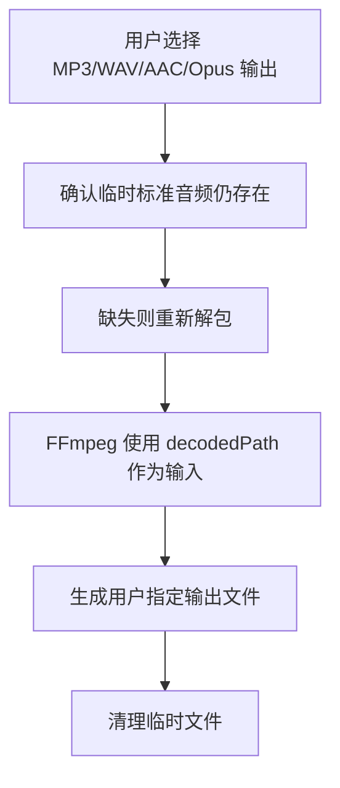

# proprietary-audio-import — 设计报告

> 关联分析：本轮对话中的“ncm/mgg/mflac 等专有音频导入适配”讨论，未单独落盘 `analysis.md`。

## 1. 目标

在 FrameLean 已支持普通视频、图片、音频处理的基础上，新增本地专有音频格式导入适配能力。用户导入 `.ncm`、`.mgg`、`.mflac` 等文件后，FrameLean 先把受支持的专有音频输入还原为标准音频临时文件，再复用现有 FFprobe / FFmpeg 音频处理链路输出为 MP3、WAV、AAC、M4A、Opus 或 Ogg Opus 等标准格式。

本功能的产品定位是“本地专有音频导入适配”，不是音乐平台下载、云端转换、版权绕过或在线解析服务。

首版目标：

- 支持 `.ncm` 输入，优先用 FrameLean 内部原生 Dart 解码实现还原为 MP3 或 FLAC 临时文件。
- 对 `.mgg`、`.mflac` 这类 QMC 格式变体先走外部适配器接口；首版能力取决于随包或开发环境中的 `framelean-qmc-adapter` / `qmc-decrypt`。
- 解包后的临时标准音频继续走 FrameLean 当前音频配置：输出格式、码率、采样率、声道和输出路径管理。
- `.ncm` 首版不再依赖随包分发的 `ncmdump` 二进制；算法来源、许可证参考和实现边界需要在文档中说明。
- 对外文案保持克制：changelog 简单说明“新增部分本地专有音频格式导入适配”，不把“解密”作为主卖点。

## 2. 现状分析

当前代码已经具备可复用的三类媒体基础：

- `MediaKind` 支持 `video`、`image`、`audio`。
- `FileExtensionMediaKindResolver` 已识别普通音频扩展名。
- `FfprobeMediaAnalyzer` 支持纯音频，不再要求视频流。
- `DefaultFfmpegCommandBuilder.buildAudioCommandPlan()` 已能把标准音频输出为 MP3、M4A/AAC、WAV、FLAC、AIFF、WMA、Opus 和 Ogg Opus。
- macOS 和 Windows 发布包已有内置 FFmpeg / FFprobe 的打包、验证和许可证文档路径。

当前不能直接支持 `.ncm`、`.mgg`、`.mflac` 的原因：

- 它们不是普通音频容器，不能直接当作 FFmpeg 输入格式。
- `.ncm` 需要先还原出真实 MP3 或 FLAC。
- QMC 系列存在多个变体；公开工具对不同后缀的支持程度不一致，部分变体需要额外 `ekey`。
- 如果只把扩展名加入 `audioExtensions`，用户导入后会在 FFprobe 阶段失败，错误位置过深，体验不可控。

候选工具现状：

| 候选 | 覆盖格式 | 许可与分发判断 | 结论 |
| --- | --- | --- | --- |
| `ncmdump` | `.ncm` 到 MP3 / FLAC | MIT；可作为算法行为参考和测试对照 | 不打包 CLI，优先实现原生 Dart NCM |
| `qmc-decrypt` | `qmcflac`、`qmc0`，以及带 `ekey` 的 `mgg1` / `mflac0` | MIT；格式覆盖不是全量 QQ 音乐格式 | 暂不内置为主路径，可作为后续 QMC 外部适配器候选 |
| Unlock Music | 支持格式广，产品形态成熟 | 原 GitHub 曾有下线风险，直接内置风险高 | 只作为行为参考，不直接打包 |
| 在线转换网页 | 覆盖面广 | 不适合桌面本地应用依赖，不可控 | 不采用 |

## 3. 数据模型与接口

### 3.1 Domain

新增专有音频输入分类，不把这些格式混入普通 `MediaOutputFormat`。

建议新增：

```text
lib/domain/enums/proprietary_audio_format.dart
lib/domain/value_objects/proprietary_audio_decode_result.dart
```

`ProprietaryAudioFormat`：

```dart
enum ProprietaryAudioFormat {
  ncm,
  qmcMgg,
  qmcMflac,
}
```

`ProprietaryAudioDecodeResult` 表达适配后的标准音频：

```dart
class ProprietaryAudioDecodeResult {
  final String decodedPath;
  final String decodedExtension;
  final String adapterName;
  final String adapterVersion;
  final bool temporary;
  final List<String> cleanupPaths;
}
```

约束：

- `domain` 不依赖进程、文件系统、FFmpeg 或第三方适配器。
- `.ncm/.mgg/.mflac` 是输入格式，不加入 `MediaOutputFormat` 的输出选项。
- 对不支持的格式变体，返回明确错误，不创建不可执行任务。

### 3.2 Application

新增服务抽象需要从 `input_runtime` 中拆出更明确的媒体输入准备目录，避免把 FFmpeg 定位、FFprobe 分析、文件检查和专有格式解包算法混在同一层。

```text
lib/application/services/media_input/
  media_input_preparer.dart
  proprietary_audio/
    proprietary_audio_format_resolver.dart
    proprietary_audio_decoder.dart
    proprietary_audio_external_adapter_registry.dart
```

接口建议：

```dart
abstract interface class ProprietaryAudioFormatResolver {
  ProprietaryAudioFormat? resolve(String inputPath);
}

abstract interface class ProprietaryAudioDecoder {
  Future<ProprietaryAudioDecodeResult> decode({
    required ProprietaryAudioFormat format,
    required String inputPath,
    required String temporaryDirectory,
  });
}

abstract interface class ProprietaryAudioExternalAdapterRegistry {
  Future<ProprietaryAudioExternalAdapterRuntime> resolveRuntime(
    ProprietaryAudioFormat format,
  );
}
```

`ImportMediaTaskUseCase` 不直接执行适配器。建议把专有音频导入拆到后台分析前：

```text
ImportMediaTaskUseCase
  -> 识别 inputPath 是 proprietary audio
  -> 创建 analyzing 任务并记录原始 inputPath
AnalyzeMediaTaskUseCase
  -> 解包到临时标准音频
  -> 用 decodedPath 调用 FFprobe
  -> 任务执行时用 decodedPath 作为 FFmpeg 输入
```

为了避免源路径与执行输入路径混淆，首版可在 application 层维护运行期解包缓存，不急于改 Drift schema。若需要跨重启恢复已解包状态，再单独增加持久化字段。

### 3.3 Infrastructure

基础输入准备、格式识别和专有音频具体实现分开：

```text
lib/infrastructure/services/media_input/
  default_media_input_preparer.dart
  file_extension_media_kind_resolver.dart
  file_extension_proprietary_audio_format_resolver.dart
  temporary_media_input_directory.dart

lib/infrastructure/services/proprietary_audio/
  proprietary_audio_decoder_dispatcher.dart
  ncm/
    native_ncm_audio_decoder.dart
    ncm_container_parser.dart
    ncm_crypto.dart
    ncm_key_box.dart
    ncm_metadata_parser.dart
  qmc/
    external_qmc_audio_decoder.dart
    bundled_qmc_adapter_registry.dart
```

`native_ncm_audio_decoder.dart` 负责文件级输入输出和 `ProprietaryAudioDecodeResult`；`ncm_container_parser.dart`、`ncm_crypto.dart`、`ncm_key_box.dart` 和 `ncm_metadata_parser.dart` 只处理字节、密钥表和元数据，方便用小样本或已知向量单测。

`proprietary_audio_decoder_dispatcher.dart` 根据 `ProprietaryAudioFormat` 分派：

- `ncm`：走原生 Dart 解码实现。
- `qmcMgg`、`qmcMflac`：走 `framelean-qmc-adapter` 外部适配器，或直接兼容 `qmc-decrypt`；适配器不可用、缺少 ekey 或变体不支持时返回明确错误。

如果后续恢复外部适配器，发布包目录只服务 QMC 等未原生实现的格式：

```text
third_party/audio_adapters/
  qmc/
    macos-arm64/
    windows-x64/
    README.md
    LICENSE
```

应用运行时目录相应保持为：

```text
FrameLean.app/Contents/Resources/audio_adapters/
FrameLean-vX.Y.Z-windows-x64/audio_adapters/
```

外部适配器执行策略只适用于 QMC 后续实现：

- 只传入本地文件路径和临时输出目录。
- 不联网，不下载，不登录，不调用平台 API。
- 使用 `Process.run` 或现有进程抽象封装，设置超时。
- 捕获 stdout/stderr，但日志中避免泄露过长路径或无关二进制内容。
- 输出文件必须在指定临时目录下，防止适配器写到不可控位置。
- 成功后校验输出文件存在且非空，再交给 FFprobe。

### 3.4 设置与持久化

首版不新增用户设置项。NCM 走原生实现，不需要用户配置适配器路径；QMC 通过随包或开发目录中的 `framelean-qmc-adapter` / `qmc-decrypt` 处理。

如果后续接入 QMC 外部适配器，再新增只读运行时状态：

- `ProprietaryAudioExternalAdapterRuntime.available`
- `ProprietaryAudioExternalAdapterRuntime.version`
- `ProprietaryAudioExternalAdapterRuntime.supportedExtensions`

如需后续允许用户替换 QMC 适配器，再扩展到设置项：

- `customQmcAdapterPath`

暂不在首版加入，避免配置面板复杂化。

## 4. 核心流程

### 4.1 导入和分析



### 4.2 执行输出



### 4.3 失败路径

| 场景 | 处理 |
| --- | --- |
| NCM 文件结构不合法 | 标记任务分析失败：该 NCM 文件无法识别或已损坏 |
| NCM 解包后没有标准音频数据 | 标记任务分析失败：未能生成可分析的标准音频 |
| 格式变体不支持 | 标记任务分析失败：当前版本暂不支持该专有音频变体 |
| QMC 需要 `ekey` | 首版不弹出密钥输入，直接说明该文件需要额外密钥，当前暂不支持 |
| 解包成功但 FFprobe 失败 | 删除临时文件并保留 FFprobe 错误摘要 |
| 用户取消任务 | 忽略准备结果，清理临时文件 |

## 5. 项目结构与技术决策

### 5.1 目录重组目标

现有临时实现把 `MediaInputPreparer`、专有音频格式识别、外部适配器发现和 CLI 执行都放在 `input_runtime` 下。加入原生 NCM 后，这个目录会同时承载 FFmpeg / FFprobe 运行时和专有格式解包算法，长期会变成不清晰的运行时杂项目录。

仓库根目录、`.workspace/`、`third_party/`、`legal/`、`scripts/` 和测试样本归位规则见 [repository-structure 设计](../../repository-structure/v1/design.md)。本节只描述 `lib/` 与测试代码内部的模块边界。

新的结构按处理阶段和实现细节拆分：

```text
lib/application/services/
  input_runtime/
    ffmpeg_locator.dart
    ffmpeg_runtime.dart
    media_analyzer.dart
    source_file_checker.dart
    source_file_fingerprint_reader.dart
  media_input/
    media_input_preparer.dart
    proprietary_audio/
      proprietary_audio_format_resolver.dart
      proprietary_audio_decoder.dart
      proprietary_audio_external_adapter_registry.dart

lib/infrastructure/services/
  input_runtime/
    ffprobe_media_analyzer.dart
    local_ffmpeg_locator.dart
    local_source_file_checker.dart
    local_source_file_fingerprint_reader.dart
  media_input/
    default_media_input_preparer.dart
    file_extension_media_kind_resolver.dart
    file_extension_proprietary_audio_format_resolver.dart
    temporary_media_input_directory.dart
  proprietary_audio/
    proprietary_audio_decoder_dispatcher.dart
    ncm/
      native_ncm_audio_decoder.dart
      ncm_container_parser.dart
      ncm_crypto.dart
      ncm_key_box.dart
      ncm_metadata_parser.dart
    qmc/
      external_qmc_audio_decoder.dart
      bundled_qmc_adapter_registry.dart
```

Provider 也同步拆分：

```text
lib/infrastructure/providers/
  input_runtime_provider.dart      FFmpeg / FFprobe、源文件检查和指纹
  media_input_provider.dart        媒体类型识别、输入准备和临时目录
  proprietary_audio_provider.dart  NCM 原生解码器、QMC 外部适配器和分派器
```

测试目录按新边界新增，不强制一次性移动所有旧测试：

```text
test/media_input/
  media_input_preparer_test.dart
  proprietary_audio_format_resolver_test.dart

test/proprietary_audio/
  ncm/
    ncm_key_box_test.dart
    ncm_container_parser_test.dart
    native_ncm_audio_decoder_test.dart
  qmc/
    external_qmc_audio_decoder_test.dart
```

### 5.2 原生 NCM 与外部适配器边界

原生 NCM 实现只放在 `infrastructure/services/proprietary_audio/ncm/`，不进入 `domain` 或 `application`。application 只依赖 `ProprietaryAudioDecoder` 抽象，因此后续替换 NCM 算法、增加 QMC 外部适配器或禁用某个格式时，不影响 `AnalyzeMediaTaskUseCase` 和 `DefaultFfmpegTaskQueueRunner` 的主流程。

NCM 原生实现需要遵守：

- 输入和输出都只使用本地文件。
- 临时输出必须写入 `MediaInputPreparer` 分配的临时目录。
- 解包后根据文件头识别 MP3 / FLAC，不靠源文件扩展名推断。
- 解析失败、密钥失败、输出为空和 FFprobe 失败分别给出可读错误。
- 算法参考来源和许可需要在 `docs/reference/third-party-audio-adapters.md` 中记录；不要复制不兼容许可代码。

QMC 仍然保留外部适配器边界。原因是 `.mgg/.mflac` 变体更多，公开工具覆盖不一致，且部分样本需要额外 `ekey`。FrameLean 主程序只约定 adapter 协议、路径发现、超时和输出校验；具体开源解码器编译与许可证材料放在 `third_party/audio_adapters/qmc/` 管理。

### 5.3 许可证与第三方声明

实现前必须锁定：

- NCM 算法参考的具体仓库、commit 或 release 版本。
- 参考实现许可证文本，以及 FrameLean 中是否只参考行为或移植代码。
- 新增 Dart crypto 依赖的许可证和平台兼容性。
- 如果后续接入 QMC 外部适配器，再补充二进制再分发、构建方式和动态库信息。

新增文档：

```text
docs/reference/third-party-audio-adapters.md
```

更新：

```text
docs/reference/ffmpeg-license-distribution.md
docs/develop/technology-stack.md
docs/develop/test-plan.md
docs/archive/changelog.md
```

### 5.4 打包脚本

NCM 原生实现不需要复制 `ncmdump` 二进制，也不需要在 macOS / Windows 产物里新增 NCM 适配器目录。

QMC 后续如接入外部适配器，再增加：

- macOS：在 `scripts/release/build_dmg_macos.sh` 或 Xcode build phase 中复制 `audio_adapters/` 到 app resources。
- Windows：在 `scripts/release/build_windows.ps1` 中复制 `audio_adapters/` 到 Release 目录。
- 打包校验：适配器文件存在、可执行、能输出版本，zip / dmg 内包含许可证。

### 5.5 迁移顺序

当前分支已经有一版外部 CLI 适配器实现。重组时按下面顺序迁移，降低破坏面：

1. 新建 `application/services/media_input/`、`infrastructure/services/media_input/` 和 `infrastructure/services/proprietary_audio/` 目录。
2. 移动 `MediaInputPreparer`、`DefaultMediaInputPreparer`、专有格式 resolver，并更新 provider import。
3. 新增 `ProprietaryAudioDecoderDispatcher`，先保持现有 CLI decoder 可用，确保测试仍过。
4. 加入 `ncm/` 原生解码模块，让 dispatcher 对 `ncm` 走原生实现。
5. 将旧 `BundledProprietaryAudioAdapterRegistry` 收窄到 QMC，或暂时移除 NCM 分支。
6. 更新测试目录、架构文档、技术栈、测试计划和 changelog。

### 5.6 UI 文案策略

使用克制、准确的表达：

- `本地专有音频导入适配`
- `该文件需要先转换为标准音频临时文件，再继续处理。`
- `请确认你有权处理该本地文件。`

避免：

- `破解`
- `绕过版权保护`
- `网易云/QQ 音乐解密转换`
- 把该能力作为首页、官网或发布标题主卖点

## 6. 分支建议

| 分支名 | 适用理由 | 风险 |
| --- | --- | --- |
| `feature/proprietary-audio-import` | 最直接表达本功能：支持专有音频导入适配 | 范围中等，必须把 NCM 和 QMC 边界写清楚 |
| `feature/native-ncm-audio-import` | 强调首版改为原生 NCM 实现 | 名称较窄，后续 QMC 需要另起范围 |
| `feature/ncm-audio-import` | 先只打通 NCM，风险最低 | 需要后续再做 QMC 分支 |
| `feature/qmc-audio-import` | 独立处理 QMC 变体和错误路径 | 不适合作为第一分支，依赖适配器选择结论 |

推荐先用 `feature/proprietary-audio-import`。如果要降低第一轮风险，可以先拆成 `feature/ncm-audio-import`，只做 `.ncm` 到标准音频，再复用 FFmpeg 输出。

## 7. 验收标准

| 验收条件 | 验收方式 |
| --- | --- |
| `.ncm` 可导入并分析为标准音频信息 | 使用本地测试样本手动导入；新增 unit test 覆盖 resolver、NCM parser、key box 和 decoder 成功路径 |
| `.ncm` 可输出 MP3、WAV、AAC/M4A、Opus / Ogg Opus | 手动端到端验证，检查输出文件存在且可播放 |
| QMC 支持范围被准确表达 | `.mgg/.mflac` 导入时要么进入已实现适配器，要么返回明确暂不支持，不进入 FFprobe 深层失败 |
| 普通音频处理不回退 | `flutter test` 中保留现有 MP3/M4A/WAV/FLAC/Opus 命令构造断言 |
| 临时文件可清理 | 单测或集成测试覆盖成功、失败、取消后的临时目录状态 |
| NCM 不依赖外部 `ncmdump` | 在未安装 `ncmdump` 的环境中，`.ncm` 分析和执行仍可走原生实现 |
| 不联网、不下载、不调用平台 API | 代码审查和集成测试确认解码器只接收本地路径 |
| 文案不越界 | Widget 测试或人工审查确认 UI/changelog 使用“专有音频导入适配”表述 |

## 8. 暂不实现

| 功能 | 理由 | 是否预留扩展 |
| --- | --- | --- |
| 在线转换服务 | 增加隐私、稳定性和合规风险；FrameLean 当前定位是本地桌面工具 | 否 |
| 平台登录、下载或抓取 | 超出本地媒体处理范围 | 否 |
| 把 NCM 算法放入 domain / application 核心 | 具体容器解析和字节级实现属于 infrastructure | 否 |
| 把 `ncmdump` 随 FrameLean 首版打包 | 原生实现可降低发布包和跨平台适配成本 | 是，保留外部适配器接口给 QMC |
| QMC `ekey` 输入 UI | 首版复杂度和解释成本高 | 是 |
| 批量目录递归导入 | 与专有音频适配无关，容易扩大范围 | 是 |
| 保证所有 `.mgg/.mflac` 变体可处理 | 公开工具覆盖不一致，不能过度承诺 | 是 |
| 把专有音频能力作为营销主卖点 | 不符合克制文案和风险边界 | 否 |
