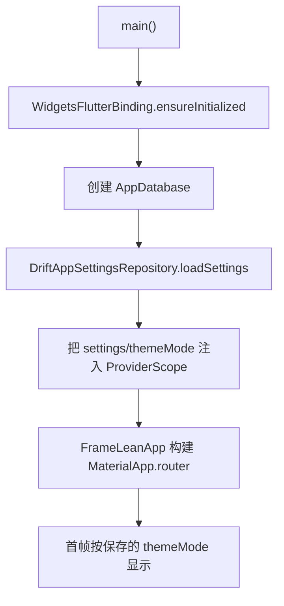
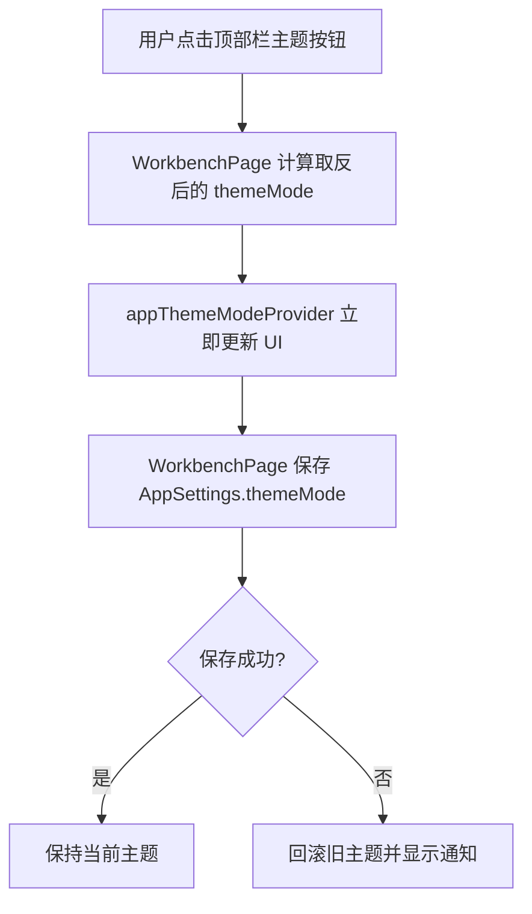

# 工作台深浅主题切换 — 设计报告

> 关联分析：上一轮内联《工作台体验与主题基础优化 — 功能分析》，当前实现已建立浅色 `ThemeExtension` 基础，见 [工作台 UI 体验与浅色主题统一](../../workbench-ui-refresh/v1/design.md)。

## 1. 目标

在工作台顶部栏右上角新增深浅主题切换按钮。按钮位于“关于 FrameLean”按钮左侧，样式和关于按钮一致，都是 32×32 的图标按钮；点击后在浅色和深色之间取反切换。

本阶段同时补齐深色主题色板和主题偏好持久化。启动体验必须满足：如果用户上次选择深色主题，应用打开时首帧就显示深色界面，不允许先显示浅色再异步闪到深色。

视觉方向采用“低眩光蓝黑工作台”：保留当前主色的品牌识别，背景转为非纯黑的深蓝灰，卡片和弹窗使用分层深色 surface，状态色提高明度但不改变语义。这个方向更适合媒体任务队列这种高频扫描型桌面工具，避免娱乐化、霓虹化或一屏多个高饱和色互相抢焦点。

## 2. 现状分析

当前代码事实：

| 区域 | 当前状态 | 影响 |
| --- | --- | --- |
| `FrameLeanColors` | 已是 `ThemeExtension`，浅色 token 已统一 | 可直接新增深色 token，不需要重拆 UI 颜色 |
| `frameLeanLightTheme()` | 只提供浅色主题 | `MaterialApp` 目前没有 `darkTheme` 和 `themeMode` |
| `FrameLeanApp` | 使用 `ScreenUtilInit` 包裹 `MaterialApp.router` | 主题切换应在 `MaterialApp.router` 级别完成 |
| `WorkbenchTopBar` | 右上角只有关于按钮 | 新按钮应在关于按钮左侧，保持同尺寸和 hover 风格 |
| `AppSettings` / `settings` | 没有主题字段，schemaVersion 为 14 | 需要新增 `theme_mode` 并迁移到 schemaVersion 15 |
| `main()` | 直接 `runApp(ProviderScope(child: FrameLeanApp()))` | 若在 UI 内异步读取主题，会出现浅色首帧再切深色 |

方案比较：

| 方案 | 产品影响 | 维护性 | 测试性 | 结论 |
| --- | --- | --- | --- | --- |
| A：仅用内存 state 切换，不保存 | 点击有效，但重启丢失；不满足用户上次选择 | 低 | 简单 | 否决 |
| B：保存到 settings，但应用显示后再读取 | 能持久化，但会出现浅色首帧闪到深色 | 中 | 中 | 否决 |
| C：启动前读取 settings，首帧确定主题 | 体验稳定，满足“不闪色”要求 | 高 | 可测 | 推荐 |
| D：接入系统主题 `ThemeMode.system` | 更完整，但用户当前要求是点击取反 | 中 | 中 | 暂不做 |

推荐方案 C：主题偏好保存进 `AppSettings`，`main()` 在 `runApp` 前创建数据库并读取一次设置，把初始主题传入根级主题状态。这样深色选择会在首帧生效。

## 3. 数据模型与接口

新增领域枚举：

```text
lib/domain/enums/app_theme_mode.dart
```

```dart
enum AppThemeMode {
  light,
  dark,
}
```

`AppSettings` 新增字段：

```dart
final AppThemeMode themeMode;
```

默认值为 `AppThemeMode.light`。`copyWith` 增加 `themeMode` 参数。

Drift `settings` 表新增字段：

```dart
TextColumn get themeMode =>
    text().named('theme_mode').withDefault(const Constant('light'))();
```

数据库迁移：

- `AppDatabase.schemaVersion` 从 `14` 升到 `15`。
- `onUpgrade` 增加 `if (from < 15) addColumn(settingsRows, settingsRows.themeMode)`。
- `DriftAppSettingsRepository.saveSettings` 写入 `settings.themeMode.name`。
- `SettingsRow.toDomain()` 读取 `themeMode`；未知值回退 `light`，不要因为单个设置值异常导致应用无法启动。

主题文件：

```text
lib/app/theme/framelean_colors.dart
lib/app/theme/framelean_theme.dart
```

新增：

```dart
const frameLeanDarkColors = FrameLeanColors(...);

ThemeData frameLeanDarkTheme() { ... }
```

浅色和深色都使用同一套 `FrameLeanColors` token，组件继续通过 `context.frameLeanColors` 取色。

根级主题状态：

```text
lib/app/theme/app_theme_controller.dart
```

建议提供：

```dart
final appThemeModeProvider =
    NotifierProvider<AppThemeController, AppThemeMode>(...);
```

职责：

- 初始值来自启动前读取的 `AppSettings.themeMode`。
- 保存当前 `AppThemeMode`，供 `MaterialApp.router` 决定 `themeMode`。
- 工作台页面负责点击切换：先更新根级主题状态，再写入 settings。
- 保存失败时由工作台页面回滚旧主题，并显示错误通知。

启动预读取：

```dart
Future<void> main() async {
  WidgetsFlutterBinding.ensureInitialized();
  final database = AppDatabase();
  final settings = await DriftAppSettingsRepository(database).loadSettings();
  runApp(
    ProviderScope(
      overrides: [
        appDatabaseProvider.overrideWithValue(database),
        initialAppSettingsProvider.overrideWithValue(settings),
      ],
      child: const FrameLeanApp(),
    ),
  );
}
```

实现时需要保证被预创建的 `database` 仍由根级容器或根级 owner 关闭，避免和 `appDatabaseProvider` 再创建第二个数据库实例。

## 4. 深色配色方案

深色不是浅色反相。主色保持 FrameLean 当前蓝色识别，但提高亮度用于深底可读；中性色采用蓝灰系，不使用纯黑，避免边框、阴影和表面层级在桌面窗口中丢失。

| Token | 深色值 | 用途 |
| --- | --- | --- |
| `primary` | `#6F8DFF` | 主按钮、切换选中态、焦点边框、分析中状态 |
| `primarySoft` | `#1A2A5F` | 选中卡背景、信息通知背景、弱主色底 |
| `progress` | `#263A86` | 任务进度背景、完成态标签背景 |
| `statusRunning` | `#FF9B3D` | 运行中标签、运行强调 |
| `statusMissingSource` | `#526987` | 找不到源文件标签 |
| `statusCancelled` | `#5F6B7A` | 已取消标签、次级禁用面 |
| `statusPending` | `#F0D84B` | 等待中标签 |
| `statusFailed` | `#FF5C6C` | 失败、删除、危险操作 |
| `runningSoft` | `#33251A` | 暂停/运行弱背景 |
| `failedSoft` | `#351B22` | 错误通知背景 |
| `surfaceCanvas` | `#0B0F17` | 工作台背景 |
| `surface` | `#121826` | 任务卡、弹窗、顶部栏、底部栏 |
| `surfaceMuted` | `#182132` | 输入框、日志、路径、弱信息区 |
| `surfaceDisabled` | `#202838` | 禁用输入、分段切换底座 |
| `border` | `#273244` | 默认边框 |
| `borderStrong` | `#3A4A63` | 选中边框、顶部栏底线 |
| `textPrimary` | `#F4F7FB` | 标题、文件名、主要文案 |
| `textSecondary` | `#B6C0CE` | 次级说明 |
| `textTertiary` | `#7E8A9A` | 占位、弱提示、文件大小 |
| `iconMuted` | `#9AA6B8` | 工具图标 |
| `shadow` | `#66000000` | 深色浮层和卡片阴影 |

滑杆在深色主题下需要额外注意：`thumbColor` 不应使用 `surface`，否则圆形拖拽点会与深色弹窗背景混在一起。全局滑杆和任务配置分段滑杆都应使用 `primary` 作为 thumb 颜色，overlay 和 value indicator 继续从 `primary` 派生。

状态前景建议：

| 状态 | 背景 | 前景 |
| --- | --- | --- |
| 运行中 | `statusRunning` | `#111827`，橙色上用深字更稳 |
| 等待中 | `statusPending` | `#111827` |
| 完成 | `progress` | `#C7D3FF` |
| 失败 | `statusFailed` | 白色 |
| 已取消 | `statusCancelled` | `#F4F7FB` |
| 找不到源文件 | `statusMissingSource` | 白色 |
| 分析中 | `primary` | `#101624` |
| 暂停中 | `runningSoft` | `statusRunning` |

这里需要一个小实现注意：当前 `FrameLeanColors.onPrimary` 固定返回白色。深色主题下 `statusPending`、`statusRunning`、`primary` 等高亮背景上可能需要深字，因此可以新增 token，例如 `onAccent`、`onWarning`，或者让状态 badge 显式选择前景色。不要把所有状态前景都继续绑定到 `onPrimary`。

## 5. 核心流程

### 启动流程



### 点击切换流程



### 顶部栏布局

`WorkbenchTopBar` 右侧按钮顺序：

```text
[ theme icon ] 8px [ about icon ] 右边距 22px
```

按钮规格：

| 项 | 设计 |
| --- | --- |
| 尺寸 | `32×32` |
| 圆角 | `8` |
| 浅色图标 | 当前浅色时显示 `Icons.dark_mode_outlined`，tooltip：`切换为深色模式` |
| 深色图标 | 当前深色时显示 `Icons.light_mode_outlined`，tooltip：`切换为浅色模式` |
| 前景色 | `colors.iconMuted` |
| hover | `colors.surfaceMuted` |
| 语义 | 图标表达“点击后的目标主题”，不是当前主题 |

## 6. 项目结构与技术决策

建议新增或调整：

```text
lib/
  main.dart
  app/
    app.dart
    theme/
      app_theme_controller.dart
      framelean_colors.dart
      framelean_theme.dart
  domain/
    enums/
      app_theme_mode.dart
    entities/
      app_settings.dart
  infrastructure/
    database/
      settings.dart
      app_database.dart
    repositories/
      drift_app_settings_repository.dart
  features/
    workbench/
      pages/workbench_page/layout/top_bar.dart
      pages/workbench_page/layout/workbench_shell.dart
      pages/workbench_page.dart
```

技术决策：

- 主题偏好属于应用设置，保存到 `AppSettings`；主题颜色属于 Flutter UI，不进入 domain。
- `AppThemeMode` 是 domain enum，但不使用 Flutter 的 `ThemeMode`，避免 domain 依赖 Flutter。
- `FrameLeanApp` 将 `AppThemeMode.light/dark` 映射为 Flutter `ThemeMode.light/dark`。
- 顶部栏只负责展示按钮和触发回调，不直接保存设置。
- 保存失败由工作台通知反馈，避免顶部栏承担业务错误提示。
- 深色主题只新增 token 和 `ThemeData`，现有组件继续通过 `context.frameLeanColors` 工作。

## 7. 分支建议

| 分支名 | 适用理由 | 风险 |
| --- | --- | --- |
| `feature/theme-toggle` | 范围直接对应深浅主题切换 | 名称较宽，但可控 |
| `feature/workbench-theme-toggle` | 强调入口在工作台顶部栏 | 若未来其他页面也用主题，名字略窄 |
| `feature/dark-theme-persistence` | 强调深色主题和启动预读 | 容易弱化顶部栏按钮交互 |
| `feature/app-theme-mode` | 强调应用级主题状态 | 对产品侧不够直观 |

推荐：`feature/workbench-theme-toggle`。

## 8. 验收标准

| 验收条件 | 验收方式 |
| --- | --- |
| 顶部栏关于按钮左侧出现主题切换图标按钮 | widget test 查找 tooltip 和按钮顺序，手动检查 macOS/Windows 顶部栏 |
| 点击按钮在浅色和深色之间取反 | widget test 调用点击并断言 `MaterialApp` themeMode 或 token 变化 |
| 深色主题下任务列表、弹窗、设置页、通知、拖拽蒙层都可读 | widget test 覆盖关键 token；手动视觉检查 |
| 用户选择深色后重启，首帧就是深色 | 集成或手动验证：保存 dark，重启应用，无浅色闪屏 |
| settings 表能保存和读取 `theme_mode` | Drift repository test 覆盖 save/load 和旧库迁移 |
| 未知 `theme_mode` 不导致启动失败 | mapper unit test，未知值回退 light |
| 浅色主题现有行为不回退 | `flutter analyze`、`flutter test` 全量通过 |

## 9. 暂不实现

| 功能 | 理由 | 是否预留扩展 |
| --- | --- | --- |
| 跟随系统主题 `system` | 用户当前要求是点击取反，且 system 会带来更多启动和平台差异判断 | 是，`AppThemeMode` 可后续新增 `system` |
| 在设置页增加主题选择项 | 用户明确指定入口在 AppBar 右上角，先保持单入口 | 是 |
| 深色主题截图自动回归 | 当前仓库以 Flutter widget/unit test 为主，截图回归成本较高 | 是 |
| 更多主题色或自定义色 | 当前目标是浅色/深色两套固定主题 | 否 |
