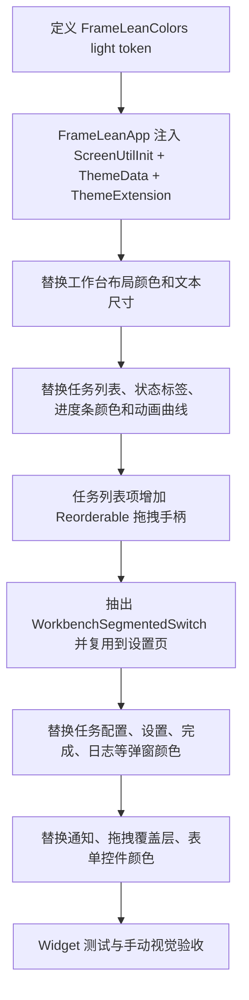

# 工作台 UI 体验与浅色主题统一 — 设计报告

> 关联分析：上一轮内联《工作台体验与主题基础优化 — 功能分析》，未落盘为 `analysis.md`。

## 1. 目标

本阶段实现工作台 UI 体验基础优化：把当前散落在 `app` 和 `features/workbench` 中的硬编码颜色抽成统一的浅色主题 token，并把可见界面改为从主题 token 取色；同时接入 `flutter_screenutil`、补齐任务列表拖拽排序入口，并复用任务配置卡里的分段切换组件。

用户提供的浅色主题色卡作为本阶段主输入：

| 语义 | 色值 |
| --- | --- |
| 界面主色 | `#1D48E6` |
| 进度条颜色 | `#D3DBFC` |
| 运行中状态标签 | `#FF8000` |
| 找不到源文件状态标签 | `#3F4C63` |
| 已取消状态标签 | `#B7BCC4` |
| 等待中状态标签 | `#E9CB0A` |
| 失败状态标签 | `#AA0315` |

本阶段交付目标：

- 建立 FrameLean 浅色主题 token 文件。
- `ThemeData`、工作台页面、任务列表、弹窗、通知、表单控件、滑杆、进度条、状态标签、底部栏和顶部栏统一取色。
- 用 `flutter_screenutil` 控制主题和工作台主要文本尺寸，并保留组件测试中的尺寸兜底。
- 任务列表通过已有 `ReorderableListView` 暴露拖拽手柄，复用现有 `sortOrder` / reorder use case 持久化顺序。
- 设置页顶部媒体类型切换复用任务配置卡的分段切换样式。
- 保留当前单浅色主题启动方式，不新增深浅主题切换，不新增 settings 表字段。
- 为后续深浅主题切换预留 `ThemeExtension` / token 结构，避免二次重构。

## 2. 现状分析

当前代码中颜色主要硬编码在这些区域：

| 区域 | 现状 |
| --- | --- |
| `lib/app/app.dart` | `ThemeData` 使用 `ColorScheme.fromSeed(seedColor: Colors.blueAccent)`，没有项目色卡，也没有 `ScreenUtilInit` |
| `widgets/form_controls/` | 输入框、下拉框边框、文字、背景色硬编码 |
| `widgets/media_task_list/` | 任务卡背景、边框、进度背景、状态标签、按钮图标色硬编码 |
| `pages/workbench_page/layout/` | 工作台背景、顶部栏、底部栏、主按钮和删除按钮色硬编码 |
| `pages/workbench_page/dialogs/` | 任务配置、完成、失败、重命名、日志、设置弹窗颜色硬编码 |
| `pages/workbench_page/overlays/` | 拖拽遮罩和右上角通知浮层颜色硬编码 |
| 设置页媒体类型切换 | 使用默认 `SegmentedButton`，视觉和任务配置卡分段控件不一致 |
| 任务列表拖拽排序 | 业务层已有 reorder use case 和 `sortOrder`，但列表项缺少明确拖拽手柄 |

当前颜色问题不是“某几个蓝色换掉”能解决的。若直接把所有 `#6290FF` 替换成 `#1D48E6`，仍会留下大量旧灰、旧蓝、旧绿、旧红，并且后续深色主题会再次拆一遍。

### 方案比较

| 方案 | 说明 | 产品影响 | 维护性 | 结论 |
| --- | --- | --- | --- | --- |
| A：直接全局替换硬编码色值 | 用搜索替换改现有颜色 | 快，但容易漏掉状态、通知、弹窗细节 | 差，深色主题还要重做 | 否决 |
| B：新增浅色 token 常量类，界面逐步引用 | 建立 `FrameLeanLightColors` 静态常量 | 简洁，改动可控 | 中，深色主题扩展时仍要调整访问方式 | 可接受但不是最优 |
| C：新增 `ThemeExtension` 承载 FrameLean 语义色 | `ThemeData.extensions` 注入浅色 token，组件通过 extension 取色 | 当前可统一浅色，未来可直接切换深浅色 token | 好 | 推荐 |
| D：把颜色放进 domain 或 AppSettings | 颜色作为业务设置保存 | 不符合当前需求 | 差，domain 会依赖 UI 概念 | 否决 |

推荐方案 C。颜色系统属于 Flutter UI 基础设施，应放在 `app` 层或 `features/workbench` 可访问的 presentation 层，不进入 `domain`、`application` 或 Drift。

## 3. 数据模型与接口

本阶段不修改数据模型：

- 不新增 `AppSettings.themePreference`。
- 不修改 `settings` 表。
- 不升级 Drift schema。
- 不改变任务状态、任务进度、队列执行和 FFmpeg 进度观测逻辑。

拖拽排序使用现有 `MediaTask.sortOrder`、`ReorderMediaTasksUseCase` 和 `MediaTaskListNotifier.reorderTasks`，不新增排序字段。`flutter_screenutil` 只作为 UI 依赖写入 `pubspec.yaml`，不影响 domain/application/infrastructure。

### 主题 token 接口

新增：

```text
lib/app/theme/framelean_theme.dart
lib/app/theme/framelean_colors.dart
lib/app/theme/framelean_responsive.dart
lib/features/workbench/theme/workbench_theme_context.dart
lib/features/workbench/widgets/form_controls/workbench_segmented_switch.dart
```

建议定义：

```dart
class FrameLeanColors extends ThemeExtension<FrameLeanColors> {
  const FrameLeanColors({
    required this.primary,
    required this.primarySoft,
    required this.progress,
    required this.statusRunning,
    required this.statusMissingSource,
    required this.statusCancelled,
    required this.statusPending,
    required this.statusFailed,
    required this.surfaceCanvas,
    required this.surface,
    required this.surfaceMuted,
    required this.border,
    required this.borderStrong,
    required this.textPrimary,
    required this.textSecondary,
    required this.textTertiary,
    required this.shadow,
  });
}
```

使用方式：

```dart
final colors = Theme.of(context).extension<FrameLeanColors>()!;
```

为了避免每个组件重复写空值断言，可以加一个 presentation helper：

```dart
extension FrameLeanThemeContext on BuildContext {
  FrameLeanColors get frameLeanColors =>
      Theme.of(this).extension<FrameLeanColors>()!;
}
```

`framelean_responsive.dart` 提供桌面基准尺寸、字体 resolver、`.flSp` / `.flR`。桌面基准尺寸按工作台最小窗口而不是移动端稿设置；字体 resolver 允许小窗口缩小，但不允许大窗口把字体放大到超过原始字号。内部也对未初始化 `ScreenUtilInit` 的组件测试场景做 fallback，避免单测直接 pump 子组件时崩溃。

### 浅色 token 定义

色卡直接色：

| Token | 色值 | 用途 |
| --- | --- | --- |
| `primary` | `#1D48E6` | 主按钮、选中态、链接、滑杆 active、焦点边框 |
| `progress` | `#D3DBFC` | 任务卡进度背景、进度淡色填充、主色弱背景 |
| `statusRunning` | `#FF8000` | 运行中标签、运行中强调 |
| `statusMissingSource` | `#3F4C63` | 找不到源文件标签 |
| `statusCancelled` | `#B7BCC4` | 已取消标签、次级禁用面 |
| `statusPending` | `#E9CB0A` | 等待中标签 |
| `statusFailed` | `#AA0315` | 失败、删除、危险操作 |

必要派生色：

| Token | 生成方式 | 用途 |
| --- | --- | --- |
| `primarySoft` | `primary` 的低透明度或浅混合色 | 推荐方案选中背景、通知 info 背景 |
| `runningSoft` | `statusRunning` 的低透明度 | 暂停/运行相关弱背景 |
| `failedSoft` | `statusFailed` 的低透明度 | 错误通知背景 |
| `surfaceCanvas` | 浅灰白 | 工作台背景 |
| `surface` | 白色 | 任务卡、弹窗、顶部栏、底部栏 |
| `surfaceMuted` | 浅灰 | 日志、路径、完成信息、输入禁用背景 |
| `border` | 中性浅灰 | 默认边框 |
| `borderStrong` | 中性较深灰 | 选中或分割边界 |
| `textPrimary` | 深中性 | 标题、文件名、主要文案 |
| `textSecondary` | 中性灰 | 次级说明 |
| `textTertiary` | 浅中性灰 | 占位、弱提示 |
| `shadow` | 黑色低透明度 | 卡片和浮层阴影 |

派生色不应随意散落在组件里。即使用 `withAlpha` 或 `withValues(alpha: ...)`，也应集中在 token 或少数 helper 中。

### 状态颜色映射

| TaskStatus | 背景 token | 前景建议 |
| --- | --- | --- |
| `running` | `statusRunning` | 白色 |
| `pending` | `statusPending` | `textPrimary`，黄色上不用白字 |
| `completed` | `progress` | `primary` 或 `statusMissingSource` |
| `failed` | `statusFailed` | 白色 |
| `cancelled` | `statusCancelled` | `textPrimary` |
| `missingSource` | `statusMissingSource` | 白色 |
| `analyzing` | `primary` | 白色 |
| `paused` | `runningSoft` 或 `statusRunning` | `statusRunning` 或白色 |

这里有一个产品判断：色卡没有单独的“已完成”和“分析中”颜色。为避免额外引入绿色，完成态使用进度淡色，分析态使用主色；这能保持色卡统一。

## 4. 核心流程

### 阶段 1：主题、响应式和交互入口统一



### 阶段 2：深浅主题切换

阶段 2 才进入上一版设计中的主题偏好和启动预读取：

- 新增 `AppThemePreference.system/light/dark`。
- Drift `settings` 新增 `theme_mode`。
- `main()` 启动前读取设置，避免浅色首帧再切深色。
- `FrameLeanApp` 同时注入 `frameLeanLightTheme` 和 `frameLeanDarkTheme`。

阶段 1 不做这些内容，避免视觉统一和数据迁移混在一个提交里。

## 5. 项目结构与技术决策

建议结构：

```text
lib/
  app/
    app.dart
	    theme/
	      framelean_colors.dart
	      framelean_responsive.dart
	      framelean_theme.dart
  features/
    workbench/
      theme/
        workbench_theme_context.dart
      widgets/
        form_controls/
          workbench_segmented_switch.dart
      pages/
```

技术决策：

- `FrameLeanColors` 使用 `ThemeExtension`，而不是纯静态常量，这样后续深色主题切换时不用重改调用方。
- 色卡直接色只在 `framelean_colors.dart` 出现一次。
- 工作台组件通过 `context.frameLeanColors` 读取语义色，不再直接写业务色值。
- Material 组件全局主题在 `framelean_theme.dart` 中定义，包括按钮、输入框、下拉框、滑杆、checkbox、tooltip 和 dialog 基础样式。
- `FrameLeanApp` 外层包 `ScreenUtilInit`，设计尺寸使用桌面工作台基准，主题和工作台组件文字使用 `.flSp`，并通过 resolver 限制字体只缩小不放大。
- `WorkbenchSegmentedSwitch` 承载任务配置卡和设置页顶部切换栏的统一视觉。
- 任务拖拽只禁用运行中的任务，避免执行队列中正在处理的任务位置被拖动。
- `ReorderableListView` 的 item 使用稳定 `ValueKey(task.id)`，本地 SDK 仍使用 `onReorder`，索引偏移由 `ReorderMediaTasksUseCase` 处理。
- 拖拽 item 子树中不启用 `Tooltip` overlay；任务行和拖拽手柄在 reorderable 场景下使用 `Semantics` 保留无障碍说明，避免 `Tooltip` / `OverlayPortal` 在拖拽 overlay 重挂载期间触发布局断言。
- 组件局部颜色只允许用于透明度、渐变或状态派生，但必须从 token 派生。

### 2026-06-07 实现补充

后续同一分支已落地深浅主题切换，详见 [工作台深浅主题切换](../../workbench-theme-toggle/v1/design.md)。当前实际实现不再停留在“单浅色主题”：`main()` 会在 `runApp` 前读取 `settings.theme_mode`，`FrameLeanApp` 注入浅色和深色主题，顶部栏主题按钮在浅色 / 深色之间取反并持久化。

拖拽排序实现过程中发现：`ReorderableListView` 拖拽代理会把 item 子树放入 overlay，如果 item 内含 `Tooltip`，`Tooltip` 依赖的 `OverlayPortal.overlayChildLayoutBuilder` 可能在 layout 阶段触发 `_RenderLayoutBuilder was mutated in _RenderLayoutBuilder.performLayout`。当前修复是仅在 reorderable 任务行内关闭 tooltip wrapper，改用 `Semantics`，普通非拖拽任务行动作仍可保留 tooltip。

建议优先替换顺序：

1. `FrameLeanApp`、`ScreenUtilInit` 和全局 `ThemeData`。
2. `MediaTaskStatusBadge`、`MediaTaskListTile`、`MediaTaskActionButton`、`MediaTaskThumbnail`。
3. `WorkbenchShell`、`WorkbenchTopBar`、`WorkbenchBottomBar`、`WorkbenchTaskListCard`。
4. `WorkbenchDialogWidgets` 和所有弹窗 action button。
5. `TaskConfigurationDialogWidgets`，特别是推荐方案卡、目标体积滑杆、分段切换、已修改/已压缩 badge。
6. `AppSettingsDialog`、`PathField`、`ConfigDropdown` 和设置页媒体类型切换。
7. `WorkbenchNotice` 和 `WorkbenchDropOverlay`。
8. 完成弹窗、日志弹窗、重命名弹窗、关于弹窗、导入失败弹窗。

## 6. 分支建议

| 分支名 | 适用理由 | 风险 |
| --- | --- | --- |
| `feature/light-theme-palette` | 聚焦浅色主题色卡统一，范围清楚 | 后续深色主题需再开任务 |
| `feature/workbench-light-theme` | 强调工作台 UI 层统一取色 | 容易漏掉 app 全局 ThemeData |
| `feature/ui-theme-foundation` | 适合同时建立未来深浅主题基础 | 名称较宽，需严格限制本阶段只做浅色 |

推荐分支：`feature/light-theme-palette`。

## 7. 验收标准

| 验收条件 | 验收方式 |
| --- | --- |
| 色卡 7 个直接色只在主题 token 文件中定义 | `rg "1D48E6|D3DBFC|FF8000|3F4C63|B7BCC4|E9CB0A|AA0315" lib` |
| 工作台页面、任务列表、顶部栏、底部栏不再使用旧主色 `#6290FF` | `rg "6290FF|315FD4|74A2FF|FF5B61|FF6B73" lib/app lib/features/workbench` |
| 任务状态标签颜色符合色卡映射 | widget 测试或 golden/截图检查 |
| 任务卡运行中进度背景使用 `#D3DBFC` 或基于主色的集中派生 token | widget 测试或截图检查 |
| 推荐方案选中态、目标体积滑杆、主要按钮统一使用主色 token | widget 测试 |
| 通知浮层不再引入独立绿色成功色，info/success 类反馈使用主色体系 | `WorkbenchNotice` 检查 |
| 所有弹窗 action button 使用统一 token：保存主色、取消灰、危险红 | widget 测试 |
| 应用仍可启动，基础 Widget 树不崩溃 | `flutter test test/widget_test.dart` |
| 静态分析通过 | `flutter analyze` |

后续实现完成后，建议手动检查：

- 空任务列表。
- 导入中 / 分析中任务。
- 等待、运行、暂停、完成、失败、取消、找不到源文件任务。
- 任务详情配置弹窗。
- 应用设置弹窗。
- 完成弹窗、日志弹窗、重命名弹窗。
- 右上角通知与拖拽覆盖层。

## 8. 暂不实现

| 功能 | 理由 | 是否预留扩展 |
| --- | --- | --- |
| 深色主题 | 用户明确要求浅色弄完后再开始 | 是，`ThemeExtension` 会预留 |
| 主题偏好入库和启动预读取 | 属于深浅切换阶段，本阶段不碰数据模型 | 是 |
| `flutter_screenutil` 接入 | 字号缩放会扩大测试面，应在颜色统一后单独处理 | 是 |
| 任务拖动排序交互 | 属于交互功能，不和色卡统一混做 | 是 |
| 进度条复杂动画重做 | 本阶段只统一颜色，动画节奏后续单独优化 | 是 |
| 用户自定义主题色 | 会破坏当前色卡统一目标 | 是 |
